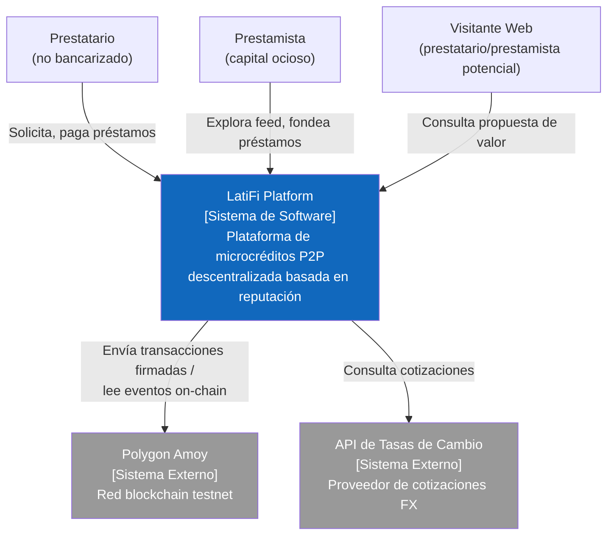
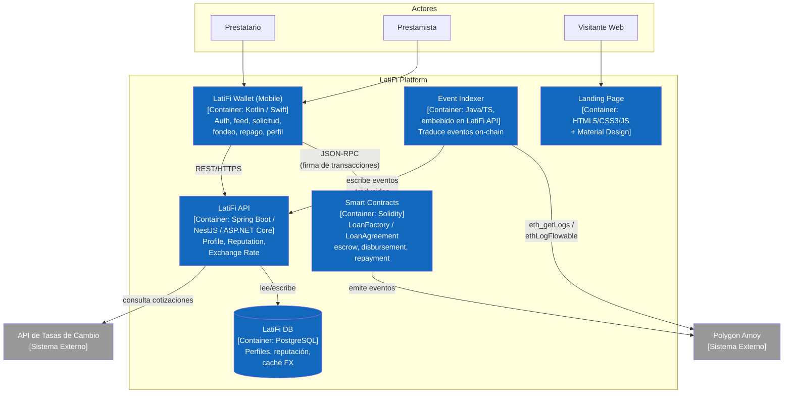

<div align="center">

<h3>Universidad Peruana de Ciencias Aplicadas</h3>

<strong>Ingeniería de Software</strong><br>
<strong>1ASI0728 - Arquitecturas De Software Emergentes - Virtual</strong><br>
<strong>Sección: 2620-9046</strong><br>
<strong>Ciclo académico: 202401</strong><br>
<strong>Profesores: Ocampo Tello, Ernesto / Rojas Malásquez, Royer Edelwer / Velásquez Núñez, Ángel Augusto</strong><br>

<br><strong>Informe del Trabajo Final</strong><br><br>

<strong>Startup: LatiFi</strong><br>
<strong>Producto: LatiFi Wallet</strong>

### Team Members:

Angulo, Juan Carlos - u202317692

Quiroz Zambrano, Fabrizio Javier - U202213406

Burga Loarte, Anaeky -u202118264

<strong>16 de septiembre de 2026</strong><br>
</div>
<div style="page-break-after: always;"></div>

# Registro de Versiones del Informe

| Versión | Fecha | Autor | Descripción de modificación |
|---|---|---|---|
| 1.0 | 2026-09-16 | Equipo LatiFi | Primera versión del informe: avance de TB1, Capítulos I a IV. |

# Project Report Collaboration Insights

URL del repositorio: https://github.com/Arquitectura-de-Softwares-Emergentes/latifi-report

_Pendiente de desarrollo: esta sección debe expandirse en cada entrega con capturas de los analíticos de colaboración y commits de GitHub, mostrando la participación de cada integrante del equipo en la elaboración del informe._

# Contenido

- [Registro de Versiones del Informe](#registro-de-versiones-del-informe)
- [Project Report Collaboration Insights](#project-report-collaboration-insights)
- [Student Outcome](#student-outcome)
- [Capítulo I: Introducción](#capítulo-i-introducción)
  - [1.1. Startup Profile](#11-startup-profile)
    - [1.1.1. Descripción de la Startup](#111-descripción-de-la-startup)
    - [1.1.2. Perfiles de integrantes del equipo](#112-perfiles-de-integrantes-del-equipo)
  - [1.2. Solution Profile](#12-solution-profile)
    - [1.2.1. Antecedentes y problemática](#121-antecedentes-y-problemática)
    - [1.2.2. Lean UX Process](#122-lean-ux-process)
      - [1.2.2.1. Lean UX Problem Statements](#1221-lean-ux-problem-statements)
      - [1.2.2.2. Lean UX Assumptions](#1222-lean-ux-assumptions)
      - [1.2.2.3. Lean UX Hypothesis Statements](#1223-lean-ux-hypothesis-statements)
      - [1.2.2.4. Lean UX Canvas](#1224-lean-ux-canvas)
  - [1.3. Segmentos objetivo](#13-segmentos-objetivo)
- [Capítulo II: Requirements Elicitation & Analysis](#capítulo-ii-requirements-elicitation--analysis)
  - [2.1. Competidores](#21-competidores)
    - [2.1.1. Análisis competitivo](#211-análisis-competitivo)
    - [2.1.2. Estrategias y tácticas frente a competidores](#212-estrategias-y-tácticas-frente-a-competidores)
  - [2.2. Entrevistas](#22-entrevistas)
    - [2.2.1. Diseño de entrevistas](#221-diseño-de-entrevistas)
    - [2.2.2. Registro de entrevistas](#222-registro-de-entrevistas)
    - [2.2.3. Análisis de entrevistas](#223-análisis-de-entrevistas)
  - [2.3. Needfinding](#23-needfinding)
    - [2.3.1. User Personas](#231-user-personas)
    - [2.3.2. User Task Matrix](#232-user-task-matrix)
    - [2.3.3. Empathy Mapping](#233-empathy-mapping)
    - [2.3.4. As-is Scenario Mapping](#234-as-is-scenario-mapping)
  - [2.4. Ubiquitous Language](#24-ubiquitous-language)
- [Capítulo III: Requirements Specification](#capítulo-iii-requirements-specification)
  - [3.1. To-Be Scenario Mapping](#31-to-be-scenario-mapping)
  - [3.2. User Stories](#32-user-stories)
  - [3.3. Impact Mapping](#33-impact-mapping)
  - [3.4. Product Backlog](#34-product-backlog)
- [Capítulo IV: Strategic-Level Software Design](#capítulo-iv-strategic-level-software-design)
  - [4.1. Strategic-Level Attribute-Driven Design](#41-strategic-level-attribute-driven-design)
  - [4.2. Strategic-Level Domain-Driven Design](#42-strategic-level-domain-driven-design)
- [Avance de Conclusiones](#avance-de-conclusiones)
- [Bibliografía](#bibliografía)
- [Anexos](#anexos)

# Student Outcome

El curso contribuye al cumplimiento del Student Outcome ABET:
**ABET – EAC - Student Outcome 3**: Capacidad de comunicarse efectivamente con un rango de audiencias.

_Pendiente de desarrollo: cada integrante debe completar, en cada entrega, las acciones realizadas y las conclusiones que sustentan el logro de este outcome, según el Anexo A del enunciado del curso._

## Capítulo I: Introducción

### 1.1. Startup Profile

#### 1.1.1. Descripción de la Startup

LatiFi es una startup peruana de base tecnológica orientada a cerrar la brecha de acceso al crédito que enfrentan los emprendedores e independientes no bancarizados de la región, mediante una plataforma de microcréditos peer-to-peer (P2P) construida sobre tecnología blockchain. A diferencia de una fintech de crédito tradicional, LatiFi no actúa como intermediario financiero centralizado: conecta directamente a prestamistas con capital ocioso y prestatarios sin historial crediticio formal a través de Smart Contracts desplegados en una red pública, de modo que las condiciones del préstamo (monto, tasa de interés, plazo, liberación de fondos) se ejecutan de forma automática e inmutable, sin que LatiFi custodie el dinero ni las llaves privadas de sus usuarios en ningún momento del proceso.

El producto insignia de LatiFi es LatiFi Wallet, una aplicación móvil nativa que permite a un prestatario publicar una solicitud de préstamo en una stablecoin y a un prestamista revisar esa solicitud junto con la reputación on-chain y off-chain del solicitante antes de decidir si la fondea. La plataforma se completa con LatiFi API, un backend propio que no participa en la lógica de otorgamiento ni cobro del préstamo, ya que esa responsabilidad vive exclusivamente en el Smart Contract, pero que sí gestiona el perfil ligero del usuario, el historial de reputación y la conversión del monto del préstamo a moneda local, de forma que un prestatario que nunca ha usado criptomonedas pueda entender cuánto debe y cuánto le prestan en soles y no solo en una unidad de stablecoin. Un Landing Page institucional explica el modelo de negocio y dirige a ambos segmentos hacia la descarga de la aplicación.

La motivación de LatiFi nace de una observación simple: la banca tradicional evalúa el riesgo de un solicitante a partir de historial crediticio formal, planillas y garantías, lo que excluye por diseño a quien trabaja de manera informal o independiente, aun cuando esa persona pague puntualmente sus compromisos cotidianos. LatiFi reemplaza esa exigencia por un modelo de reputación que combina el comportamiento de repago verificable en la blockchain con señales complementarias registradas en su propio backend, sin exigir colateral bloqueado como sí lo hacen los protocolos DeFi de sobrecolateralización, que por definición excluyen a quien no tiene activos cripto que dejar en garantía.

El alcance de LatiFi en este informe es acotado: se trata del proyecto final del curso SI728 Arquitecturas de Software Emergentes de la UPC, por lo que no existe un modelo de ingresos real ni manejo de dinero efectivo. Todo el flujo de solicitud, fondeo, ejecución del Smart Contract, repago y actualización de reputación se demuestra de principio a fin sobre la testnet Polygon Amoy, utilizando una stablecoin de prueba sin valor monetario real. El objetivo del equipo no es validar la viabilidad comercial de LatiFi como negocio, sino demostrar competencias de arquitectura de software emergente, es decir, Domain-Driven Design estratégico y táctico, diagramas C4, Lean UX y prácticas ágiles, aplicadas a un dominio de producto con problemática real y verificable.

#### 1.1.2. Perfiles de integrantes del equipo

| Miembro | Descripción|
|---|---|
| **Angulo, Juan Carlos - U202317692** | Estudiante de Ingeniería de Software en séptimo ciclo. Le apasiona aprender tecnologías nuevas y construir soluciones aplicadas a problemas reales, y en este curso le entusiasma especialmente trabajar con blockchain. |
| **Quiroz Zambrano, Fabrizio Javier - U202213406** | Estudiante de Ingeniería de Software, con interés en el desarrollo de aplicaciones móviles y en arquitectura de software. Contribuye al proyecto en el desarrollo técnico y la documentación del informe. || Miembro 3 | -Nombre y Apellido, código- <br><br> -Descripción a completar por el integrante- |

### 1.2. Solution Profile

#### 1.2.1. Antecedentes y problemática

##### Antecedentes

El acceso al crédito formal en el Perú continúa siendo un privilegio de quien ya está dentro del sistema financiero. Según cifras de inclusión financiera elaboradas a partir de datos del INEI y el BCRP, en el segundo trimestre de 2025 el 61.6% de la población adulta contaba con al menos una cuenta en el sistema financiero (ahorro, sueldo, corriente o plazo fijo), un avance de 2.4 puntos porcentuales respecto al mismo trimestre de 2024 (Gan@Más, 2025). Ese mismo dato, leído en negativo, significa que cerca de cuatro de cada diez peruanos permanece fuera del sistema financiero formal (Gestión/INEI, s.f.), y la brecha se agrava fuertemente por zona geográfica: mientras el 65.5% de la población adulta urbana tiene acceso a una cuenta, en el ámbito rural la cifra cae a 41.8% (Gan@Más, 2025). El Global Findex 2025 del Banco Mundial, que encuestó a más de 145,000 adultos en 141 economías durante 2024, confirma la magnitud del problema a escala global: 1,300 millones de adultos en el mundo aún no tienen una cuenta financiera, aunque el reporte no permite aislar con precisión la cifra específica de no bancarizados para Perú a partir de las fuentes consultadas para este informe (World Bank Global Findex, 2025).

Este vacío de acceso convive con un mercado laboral donde la informalidad es la norma, no la excepción. De acuerdo con la Encuesta Permanente de Empleo Nacional del INEI, entre abril de 2024 y marzo de 2025 el 70.7% de la población ocupada del país tenía un empleo informal (INEI, 2025), y el 45% de los ocupados corresponde a trabajadores independientes o familiares no remunerados, proporción que sube a 50.2% entre las mujeres (INEI, 2025). Dentro del universo empresarial, el desajuste es todavía más marcado: según ComexPerú, en el Perú operan 6.1 millones de micro y pequeñas empresas, el 99.7% del total de empresas del país, de las cuales el 86.8% no está registrada ante la SUNAT (ComexPerú, 2024), lo que las deja, en la práctica, sin historial tributario ni bancario que un evaluador de crédito tradicional pueda revisar. Es precisamente este universo de emprendedores e independientes, con ingresos reales pero sin el papel que un banco exige, el que LatiFi busca atender.

Una población amplia sin acceso al crédito formal, un mercado laboral mayoritariamente informal y una adopción cripto que ya empieza a pesar: sobre esos tres puntos LatiFi construye su propuesta. Perú superó el millón de usuarios de criptomonedas y escaló al puesto 42 del ranking mundial de adopción cripto según el Global Crypto Adoption Index 2024 de Chainalysis, avanzando al puesto 34 en la edición 2025 (Infobae, 2025); el 3.7% de los peruanos ya utiliza criptomonedas (Infobae, 2025), y a nivel regional las stablecoins concentran cerca del 90% del volumen de transacciones cripto, con los usuarios peruanos inclinándose de forma particular hacia stablecoins denominadas en dólares (Forbes Perú, 2026).

##### Aplicación de la técnica 5W + 2H

| Pregunta | Respuesta |
|--|--|
| **Who** <br> (¿Quién?) | Emprendedores e independientes no bancarizados del Perú que necesitan un microcrédito para su actividad económica, y personas con capital ocioso dispuestas a prestarlo bajo un modelo P2P sin intermediario bancario. |
| **What** <br> (¿Qué?) | Ausencia de un mecanismo de crédito accesible para quien no tiene historial crediticio formal ni activos que dejar en garantía, dado que la banca tradicional exige planilla, historial en centrales de riesgo o colateral, y los protocolos DeFi existentes exigen sobrecolateralización que este segmento no puede cumplir. |
| **Where** <br> (¿Dónde?) | Perú, con foco inicial en emprendedores e independientes urbanos y periurbanos que ya cuentan con un teléfono inteligente, dado que la brecha de inclusión financiera es más aguda en zonas rurales (41.8% de acceso a cuenta financiera) que en zonas urbanas (65.5%) (Gan@Más, 2025). |
| **When** <br> (¿Cuándo?) | El problema es estructural y persiste pese a la mejora reciente en indicadores de inclusión financiera: la tasa de informalidad laboral solo cayó poco más de tres puntos porcentuales entre 2022 y 2024-2025 (INEI, 2025), mientras que la adopción de criptoactivos en el país crece de forma acelerada en el mismo periodo (Infobae, 2025). |
| **Why** <br> (¿Por qué?) | Porque el modelo de evaluación crediticia tradicional está diseñado para quien ya tiene historial formal, excluyendo por defecto a quien trabaja de manera independiente o informal aunque cumpla puntualmente sus compromisos de pago, y porque las alternativas DeFi de crédito descentralizado existentes (Aave, Compound) exigen colateral bloqueado que este segmento, por definición, no posee. |
| **How** <br> (¿Cómo?) | A través de una app móvil nativa (LatiFi Wallet) que conecta al prestatario con prestamistas P2P mediante un Smart Contract que ejecuta de forma inmutable el fondeo y el repago del préstamo, respaldado por un modelo de reputación híbrido on-chain/off-chain gestionado por un backend propio (LatiFi API) que también expone el monto del préstamo en moneda local. |
| **How Much** <br> (¿Cuánto?) | El costo de no resolver el problema se traduce en un universo amplio de emprendedores e independientes, el 45% de la población ocupada del país (INEI, 2025), sin acceso a capital de trabajo formal, empujados hacia prestamistas informales o hacia la descapitalización de su propio negocio; a nivel académico, el costo de no resolverlo es no demostrar un flujo Web3 completo y auditable dentro de las 15 semanas del curso. |

##### Problemática

Los emprendedores e independientes no bancarizados del Perú, un segmento que representa cerca del 45% de la población ocupada del país y que en buena parte opera dentro de micro y pequeñas empresas no registradas ante la SUNAT, enfrentan una exclusión estructural del crédito formal, porque los criterios de evaluación bancaria dependen de historial crediticio y planilla que este segmento no posee, mientras que las alternativas de crédito descentralizado (DeFi) existentes exigen sobrecolateralización en criptoactivos que tampoco están a su alcance. El resultado es que un emprendedor con capacidad real de pago, pero sin papel que lo respalde, queda fuera tanto del sistema financiero tradicional como de las soluciones cripto actuales, mientras que del otro lado existen personas con capital ocioso dispuestas a prestarlo de forma directa si contaran con una señal de riesgo confiable y un mecanismo que garantice el cumplimiento de las condiciones pactadas sin depender de la palabra de un desconocido.

##### Puntos más importantes a resolver

> Autenticación no custodial del usuario mediante su propia billetera digital, sin que LatiFi almacene ni gestione las llaves privadas del prestatario o del prestamista.

> Publicación de solicitudes de préstamo por parte del prestatario (monto, tasa de interés, plazo) en una stablecoin, sin exigir colateral bloqueado como condición de acceso.

> Visibilidad de la reputación del solicitante para el prestamista, como sustituto de la central de riesgo bancaria que este segmento no tiene, combinando señales on-chain (historial de repago verificable en el Smart Contract) con señales off-chain (perfil registrado en LatiFi API).

> Ejecución inmutable del fondeo y del repago del préstamo mediante Smart Contract, de modo que ni LatiFi ni ninguna de las partes pueda alterar unilateralmente las condiciones pactadas.

> Actualización automática y gradual de la reputación del prestatario tras cada resultado de préstamo (pagado a tiempo, tardío o incumplido), evitando un esquema binario que no refleje comportamientos de pago parcial.

> Visualización del monto del préstamo y de las cuotas en moneda local además de en stablecoin, para que un usuario sin experiencia previa en criptoactivos comprenda en todo momento cuánto debe o cuánto va a recibir.

> Un onboarding progresivo y en lenguaje simple, sin jerga cripto, dado que el segmento objetivo no tiene por qué tener experiencia previa con billeteras digitales.

##### Objetivos

- Demostrar un flujo completo de microcrédito P2P (solicitud → fondeo → ejecución del Smart Contract → repago → actualización de reputación) ejecutado de principio a fin sobre la testnet Polygon Amoy.
- Sustituir el colateral bloqueado como mecanismo de mitigación de riesgo por un modelo de reputación híbrido on-chain/off-chain, sin recurrir a KYC documental pesado que contradiga la premisa de servir a usuarios no bancarizados.
- Ofrecer a un prestatario sin historial crediticio formal un canal de acceso a capital de trabajo directo, mediado por un Smart Contract y no por una entidad financiera centralizada.
- Ofrecer a un prestamista con capital ocioso una señal de riesgo confiable (reputación) antes de decidir fondear una solicitud, y la garantía de que las condiciones pactadas se ejecutan de forma automática.
- Aplicar de manera consistente las prácticas de arquitectura de software emergente exigidas por el curso (DDD estratégico y táctico, diagramas C4, Lean UX, Scrum) sobre un dominio de problema real y verificable con datos públicos.

##### Restricciones

- El desarrollo se limita a un despliegue sobre la testnet Polygon Amoy; queda fuera de alcance cualquier manejo de dinero real o despliegue en mainnet.
- El modelo de riesgo del MVP se basa exclusivamente en reputación on-chain/off-chain; no se implementa colateral ni garantías bloqueadas, para no diluir la tesis diferenciadora del proyecto ni duplicar la complejidad del Smart Contract.
- LatiFi no ejerce custodia de las llaves privadas de sus usuarios; la autenticación y firma de transacciones se realiza mediante una billetera no custodial (WalletConnect/Metamask SDK equivalente) integrada a la app.
- La aplicación móvil se desarrolla en tecnología nativa (Kotlin para Android o Swift para iOS); el enunciado del curso prohíbe explícitamente el uso de frameworks híbridos.
- La lógica de negocio del préstamo (matching, fondeo, repago, default) vive exclusivamente en el Smart Contract; LatiFi API se limita a exponer perfil de usuario, historial de reputación y tasas de cambio, sin duplicar ni re-decidir el estado del préstamo.
- El proceso de verificación de identidad se limita a un registro de perfil ligero (KYC-lite: nombre y contacto) como base mínima de resistencia a ataques Sybil; queda fuera de alcance el KYC documental basado en escaneo de identidad y verificación de vida, por ser desproporcionado para una demo académica y contradictorio con la premisa de servir a usuarios sin documentación formal.
- El backend REST se construye únicamente con los frameworks permitidos por el curso (Spring Boot, ASP.NET Core o NestJS), y el desarrollo debe seguir GitFlow y Conventional Commits para su calificación.

#### 1.2.2. Lean UX Process

El Lean UX Process de Jeff Gothelf y Josh Seiden convierte la problemática descrita en la sección anterior en creencias explícitas (assumptions) sobre el negocio y los usuarios de LatiFi, y esas creencias en hypothesis statements verificables mediante experimentos concretos. El análisis cubre el dominio completo del problema, el microcrédito P2P descentralizado para no bancarizados, y no un segmento por separado, siguiendo el template del curso para una iniciativa nueva (brand new initiative).

##### 1.2.2.1. Lean UX Problem Statements

LatiFi tiene un único Problem Statement, que agrupa a los dos segmentos identificados (prestatarios y prestamistas). El template exigido por el curso para una iniciativa nueva se completa en inglés, tal como aparece en el enunciado del proyecto:

> The current state of **access to microcredit for unbanked entrepreneurs and independent workers in Peru** has focused mainly on **traditional banks that require formal credit history, payroll records, or physical collateral before granting a loan, leaving out anyone who works informally or independently, even when that person reliably meets their day-to-day payment obligations**.
>
> What existing products/services fail to address is **the gap between a large population of creditworthy, hardworking entrepreneurs and independent workers with no formal credit history or collateral to offer, and the credit products available to them, since both traditional banks and existing decentralized (DeFi) lending protocols require documentation or over-collateralization that this segment cannot provide**.
>
> Our product/service will address this gap by **connecting borrowers directly with peer-to-peer lenders through a non-custodial mobile wallet, using a hybrid on-chain/off-chain reputation model instead of collateral, with loan terms funded, disbursed, and repaid automatically and immutably through a Smart Contract**.
>
> Our initial focus will be **unbanked or underbanked entrepreneurs and independent workers in Peru who need short-term working capital, and individuals with idle capital willing to lend it directly on a peer-to-peer basis**.
>
> We'll know we are successful when we see **a complete loan cycle (request, funding, Smart Contract execution, repayment, and reputation update) demonstrated end-to-end on the Polygon Amoy testnet, with borrowers able to understand their loan terms in local currency and lenders able to make a funding decision based on a visible reputation score**.

En español, el mismo Problem Statement dice lo siguiente. Hoy el acceso al microcrédito para emprendedores e independientes no bancarizados en el Perú descansa en bancos tradicionales que exigen historial crediticio formal, planilla o garantías físicas antes de prestar, dejando fuera a cualquiera que trabaje de manera informal o independiente, aun si cumple puntualmente sus obligaciones de pago cotidianas. Lo que el mercado no resuelve es la brecha entre una población amplia de emprendedores e independientes solventes, sin historial crediticio formal ni colateral que ofrecer, y los productos de crédito disponibles para ellos, ya que tanto la banca tradicional como los protocolos DeFi existentes exigen documentación o sobrecolateralización que este segmento no puede cumplir. LatiFi cierra esa brecha conectando directamente a prestatarios con prestamistas P2P a través de una billetera móvil no custodial, usando un modelo de reputación híbrido on-chain/off-chain en lugar de colateral, con condiciones de préstamo fondeadas, desembolsadas y repagadas de forma automática e inmutable mediante un Smart Contract. El foco inicial son emprendedores e independientes no bancarizados o subatendidos del Perú que necesitan capital de trabajo de corto plazo, y personas con capital ocioso dispuestas a prestarlo de forma directa. El éxito se mide en un ciclo completo de préstamo demostrado de punta a punta en la testnet Polygon Amoy, con prestatarios capaces de entender las condiciones de su préstamo en moneda local y prestamistas capaces de decidir el fondeo con base en una reputación visible.

##### 1.2.2.2. Lean UX Assumptions

El curso pide organizar los assumptions en 5 tipos. Cada uno se redacta como una creencia afirmativa, no como la pregunta que la originó.

**Business Assumptions**

- LatiFi puede demostrar de forma creíble, dentro del alcance académico del curso, un modelo de crédito P2P alternativo al de la banca tradicional y al de los protocolos DeFi sobrecolateralizados.
- Un modelo de reputación híbrido on-chain/off-chain es suficiente para mitigar el riesgo de impago sin necesidad de exigir colateral, incluso frente a usuarios sin historial previo en blockchain.
- El equipo cuenta con las capacidades técnicas (Solidity, desarrollo móvil nativo, arquitectura de backend REST) necesarias para construir el flujo completo sin depender de un tercero crítico fuera del curso.
- Separar la lógica de préstamo (en el Smart Contract) del backend propio (perfil, reputación, tasas de cambio) es suficiente para cumplir el requisito del curso de tener tanto una solución Web3 no custodial como un RESTful API de elaboración interna.
- Un KYC-lite (nombre y contacto) es suficiente resistencia a ataques Sybil para efectos de la demo, sin necesidad de verificación documental pesada.

**Business Outcome Assumptions**

- El flujo completo de préstamo (solicitud, fondeo, Smart Contract, repago, actualización de reputación) puede ejecutarse de punta a punta en la testnet Polygon Amoy dentro del cronograma de 15 semanas del curso.
- El número de solicitudes de préstamo fondeadas durante la demo aumenta conforme los prestamistas de prueba ganan confianza en la señal de reputación mostrada.
- La cantidad de préstamos que llegan a un ciclo de repago completo (y no solo de fondeo) es suficiente para poblar el modelo de reputación con datos reales antes de la entrega final.
- El equipo logra evidenciar, ante la rúbrica del curso, que la lógica de préstamo vive exclusivamente en el Smart Contract y no fue duplicada en el backend propio.

**User Assumptions**

- El prestatario principal es un emprendedor o independiente no bancarizado, con poca o ninguna experiencia previa con billeteras cripto, que necesita capital de trabajo de corto plazo para su actividad económica.
- El prestamista principal es una persona con algo de capital ocioso, más familiarizada con conceptos financieros o cripto que el prestatario promedio, dispuesta a prestar de forma directa a cambio de un interés y motivada por la señal de reputación antes de decidir.
- La mayoría de la interacción del prestatario ocurre desde el celular, en momentos puntuales (solicitar el préstamo, revisar su reputación, pagar la cuota), no como uso recurrente diario.
- El prestamista revisa el feed de solicitudes de forma más deliberada, comparando reputación, monto e interés antes de fondear, similar a cómo un inversionista evalúa una oportunidad.
- Ninguno de los dos segmentos tiene experiencia previa gestionando una billetera no custodial ni una frase semilla, por lo que ambos requieren un onboarding guiado y en lenguaje simple.

**User Outcome and Benefit Assumptions**

- El prestatario obtiene acceso a capital de trabajo que la banca tradicional le habría negado por falta de historial crediticio formal.
- El prestatario no necesita bloquear ningún activo como garantía, a diferencia de lo que exigiría un protocolo DeFi sobrecolateralizado.
- El prestamista cuenta con una señal de riesgo (reputación) antes de fondear, en lugar de prestar a ciegas a un desconocido.
- Ambos usuarios confían en que las condiciones pactadas (monto, interés, plazo, liberación de fondos) se cumplen automáticamente, sin depender de la buena fe de la otra parte ni de la gestión manual de LatiFi.
- El prestatario entiende en todo momento cuánto debe en su propia moneda local, no solo en una unidad de stablecoin que le resulta ajena.

**Feature Assumptions**

- Una autenticación no custodial mediante billetera digital (WalletConnect/Metamask SDK equivalente) permite que el usuario controle sus propios fondos y firme transacciones sin que LatiFi custodie su llave privada.
- Un módulo de publicación de solicitudes de préstamo (monto, interés, plazo) le da al prestatario un canal directo para expresar su necesidad de capital, sin pasar por la evaluación de un oficial de crédito bancario.
- Un feed de solicitudes que muestra la reputación del solicitante le permite al prestamista decidir a quién fondear con una señal de riesgo visible, replicando el rol de una central de riesgo que este segmento no tiene.
- Un flujo de fondeo ejecutado por el Smart Contract transfiere los fondos del prestamista al prestatario y registra las condiciones de forma inmutable, sin intermediación humana ni margen de alteración posterior.
- Un flujo de repago ejecutado por el Smart Contract libera capital e interés al prestamista de forma automática apenas el prestatario paga, cerrando el ciclo del préstamo sin gestión manual.
- Un motor de reputación híbrido, que combina eventos on-chain del Smart Contract con señales off-chain del perfil en LatiFi API, actualiza el puntaje del prestatario tras cada resultado de préstamo.
- Una pantalla que muestra el monto del préstamo y las cuotas en moneda local, además de en stablecoin, usando la API de tasas de cambio de LatiFi API, permite que el usuario entienda su compromiso de pago sin necesidad de convertir manualmente.

##### 1.2.2.3. Lean UX Hypothesis Statements

Cada Feature Assumption tiene su hypothesis statement correspondiente, siguiendo el template del curso (también en inglés):

> **HS-01: Autenticación no custodial con billetera digital**
> We believe we will achieve **an increase in the number of borrowers and lenders who complete onboarding and remain active in the platform**
> If **unbanked entrepreneurs and idle-capital lenders**
> Attain **full control over their own funds and private keys, without depending on LatiFi as a custodian**
> With **a non-custodial wallet authentication module (WalletConnect/Metamask SDK equivalent) integrated into the mobile app**.
>
> *Creemos que lograremos más prestatarios y prestamistas que completan el onboarding y permanecen activos en la plataforma si los emprendedores no bancarizados y los prestamistas con capital ocioso obtienen control total de sus propios fondos y llaves privadas, sin depender de LatiFi como custodio, con un módulo de autenticación no custodial mediante billetera digital integrado a la app móvil.*

> **HS-02: Publicación de solicitudes de préstamo**
> We believe we will achieve **an increase in the number of loan requests published on the platform**
> If **unbanked entrepreneurs and independent workers**
> Attain **a direct channel to request working capital without going through a bank's credit evaluation process**
> With **a loan request creation module where the borrower specifies amount, interest rate, and term in a stablecoin**.
>
> *Creemos que lograremos más solicitudes de préstamo publicadas en la plataforma si los emprendedores e independientes no bancarizados obtienen un canal directo para solicitar capital de trabajo sin pasar por la evaluación crediticia de un banco, con un módulo de publicación de solicitudes donde el prestatario especifica monto, tasa de interés y plazo en una stablecoin.*

> **HS-03: Feed de prestamistas con reputación visible**
> We believe we will achieve **an increase in the number of loan requests funded per active lender**
> If **lenders with idle capital**
> Attain **a visible, trustworthy risk signal about each borrower before deciding to fund a request**
> With **a lender feed that surfaces each open loan request together with the requester's on-chain/off-chain reputation score**.
>
> *Creemos que lograremos más solicitudes fondeadas por cada prestamista activo si los prestamistas con capital ocioso obtienen una señal de riesgo visible y confiable sobre cada prestatario antes de decidir fondear, con un feed que muestra cada solicitud abierta junto con la reputación on-chain/off-chain del solicitante.*

> **HS-04: Flujo de fondeo vía Smart Contract**
> We believe we will achieve **an increase in lender trust and repeat funding behavior**
> If **lenders**
> Attain **certainty that funds are transferred to the borrower and loan terms are recorded immutably, with no possibility of manual alteration**
> With **a Smart Contract funding flow that escrows and disburses funds automatically once a lender funds a request**.
>
> *Creemos que lograremos mayor confianza del prestamista y más fondeos recurrentes si los prestamistas obtienen certeza de que los fondos se transfieren al prestatario y las condiciones del préstamo quedan registradas de forma inmutable, sin posibilidad de alteración manual, con un flujo de fondeo ejecutado por el Smart Contract que transfiere los fondos automáticamente.*

> **HS-05: Flujo de repago vía Smart Contract**
> We believe we will achieve **an increase in the number of loans that reach a completed repayment cycle**
> If **borrowers and lenders**
> Attain **an automatic release of capital and interest to the lender as soon as the borrower repays, without manual reconciliation**
> With **a Smart Contract repayment flow triggered directly from the borrower's mobile app**.
>
> *Creemos que lograremos más préstamos que llegan a un ciclo de repago completo si prestatarios y prestamistas obtienen la liberación automática de capital e interés al prestamista apenas el prestatario paga, sin conciliación manual, con un flujo de repago ejecutado por el Smart Contract directamente desde la app móvil del prestatario.*

> **HS-06: Motor de reputación híbrido**
> We believe we will achieve **an increase in the accuracy and trustworthiness of the reputation score shown to lenders**
> If **borrowers with little or no prior on-chain history**
> Attain **a reputation score that reflects both their on-chain repayment behavior and off-chain profile signals, instead of relying on wallet activity alone**
> With **a hybrid on-chain/off-chain reputation engine that updates the borrower's score after every loan outcome**.
>
> *Creemos que lograremos una reputación más precisa y confiable para los prestamistas si los prestatarios con poco o ningún historial on-chain previo obtienen un puntaje que refleja tanto su comportamiento de repago on-chain como señales de su perfil off-chain, en lugar de depender solo de su actividad en la billetera, con un motor de reputación híbrido que actualiza el puntaje tras cada resultado de préstamo.*

> **HS-07: Visualización en moneda local**
> We believe we will achieve **an increase in the number of borrowers who understand their loan terms correctly before accepting them**
> If **unbanked borrowers unfamiliar with cryptocurrency units**
> Attain **a clear view of the loan amount and installments in their own local currency, alongside the stablecoin amount**
> With **a local-currency display screen powered by the LatiFi API exchange-rate endpoint**.
>
> *Creemos que lograremos más prestatarios que entienden correctamente las condiciones de su préstamo antes de aceptarlas si los prestatarios no bancarizados, poco familiarizados con unidades cripto, obtienen una vista clara del monto y las cuotas en su propia moneda local junto al monto en stablecoin, con una pantalla de visualización en moneda local alimentada por el endpoint de tasas de cambio de LatiFi API.*

##### 1.2.2.4. Lean UX Canvas

| Elemento | Contenido |
|---|---|
| **1. Business Problem** <br> (Problema de negocio) | Los emprendedores e independientes no bancarizados del Perú, cerca del 45% de la población ocupada del país (INEI, 2025), quedan excluidos tanto del crédito bancario tradicional, que exige historial formal y planilla, como de los protocolos DeFi de crédito descentralizado, que exigen colateral bloqueado que este segmento no posee. |
| **2. Business Outcomes** <br> (Resultados de negocio) | Demostración end-to-end del flujo de préstamo en Polygon Amoy dentro del cronograma del curso; aumento en el número de solicitudes fondeadas y en préstamos que completan su ciclo de repago; evidencia clara de que la lógica de préstamo vive únicamente en el Smart Contract. |
| **3. Users** <br> (Usuarios) | Prestatario: emprendedor o independiente no bancarizado que solicita el microcrédito (usuario principal). Prestamista: persona con capital ocioso que fondea solicitudes P2P (usuario principal del lado de la oferta). |
| **4. User Outcomes & Benefits** <br> (Resultados y beneficios para el usuario) | El prestatario accede a capital de trabajo sin colateral ni historial crediticio formal, y entiende su deuda en moneda local; el prestamista decide con una señal de riesgo visible (reputación) y confía en que el Smart Contract hace cumplir lo pactado sin intermediación humana. |
| **5. Solutions** <br> (Soluciones / Features) | Autenticación no custodial; publicación de solicitudes de préstamo; feed de prestamistas con reputación visible; flujo de fondeo vía Smart Contract; flujo de repago vía Smart Contract; motor de reputación híbrido on-chain/off-chain; visualización en moneda local vía LatiFi API. |
| **6. Hypotheses** <br> (Hipótesis) | HS-01 a HS-07 (ver sección 1.2.2.3), una por cada Feature Assumption identificada. |
| **7. What's the most important thing we need to learn first?** <br> (Lo más importante que aprender primero) | Si un prestamista confía lo suficiente en un puntaje de reputación calculado por un modelo híbrido on-chain/off-chain como para fondear a un desconocido sin colateral de por medio, y si un prestatario sin experiencia previa en cripto logra completar el flujo de autenticación no custodial y de solicitud de préstamo sin abandonar en el camino. |
| **8. What's the least amount of work we can do to learn the next most important thing?** <br> (El experimento mínimo viable) | Un prototipo del ciclo completo billetera → Smart Contract → LatiFi API → app móvil, con una sola stablecoin de prueba en Polygon Amoy, presentado a un grupo reducido de prestatarios y prestamistas simulados (compañeros o usuarios de prueba sin experiencia cripto previa) para validar la confianza en la reputación y la comprensión del monto en moneda local, sin necesidad de desplegar la totalidad de las funcionalidades de v1.x. |

### 1.3. Segmentos objetivo

Los segmentos objetivo de LatiFi se derivan directamente de los User Assumptions definidos en el Lean UX Canvas (ver sección 1.2.2.2): dos roles distintos interactúan con la plataforma desde extremos opuestos del mismo Smart Contract, y a ellos se dirigirá el proceso de Needfinding y la construcción posterior de los User Persona (Capítulo II). Cada segmento se describe a continuación considerando sus características demográficas y la información estadística que sustenta su relevancia dentro del dominio del problema.

#### Segmento 1: Prestatario, Emprendedor o Independiente No Bancarizado (segmento principal)

**Descripción.** Es la persona que solicita el microcrédito a través de LatiFi Wallet para financiar capital de trabajo de su actividad económica (compra de mercadería, insumos, herramientas de trabajo). Trabaja de manera informal o independiente, por lo que no cuenta con planilla ni historial crediticio formal que un banco tradicional pueda evaluar, y tampoco dispone de activos cripto para dejar en garantía en un protocolo DeFi sobrecolateralizado. Publica su solicitud especificando monto, interés y plazo, y su reputación, construida a partir de su historial de repago y de su perfil en LatiFi API, es lo que determina si un prestamista decide fondearlo.

**Características demográficas.** Adultos entre 20 y 55 años, con educación secundaria completa como mínimo y, en muchos casos, sin estudios superiores culminados; ocupación como comerciante ambulante o de mercado, transportista independiente, trabajador de delivery, artesano o microempresario de subsistencia. Se ubican principalmente en zonas urbanas y periurbanas del Perú con acceso a un teléfono inteligente y conexión a internet móvil, dado que sin ese requisito mínimo no pueden acceder a la app; la brecha de inclusión financiera es más severa en el ámbito rural (41.8% de acceso a cuenta financiera) que en el urbano (65.5%) (Gan@Más, 2025), lo que orienta el foco inicial de validación hacia el segundo.

**Información estadística de sustento.** Según la Encuesta Permanente de Empleo Nacional del INEI, entre abril de 2024 y marzo de 2025 el 70.7% de la población ocupada del Perú tenía un empleo informal, y el 45% de los ocupados corresponde a trabajadores independientes o familiares no remunerados, proporción que llega a 50.2% entre las mujeres (INEI, 2025). A nivel empresarial, ComexPerú reporta que el país cuenta con 6.1 millones de micro y pequeñas empresas, el 99.7% del total de empresas del Perú, de las cuales el 86.8% no está registrada ante la SUNAT (ComexPerú, 2024), lo que confirma que el universo de potenciales prestatarios sin historial crediticio formal es amplio y estructural, no una excepción del mercado. A esto se suma que, en el segundo trimestre de 2025, cerca de cuatro de cada diez adultos peruanos permanecía fuera del sistema financiero formal (Gestión/INEI, s.f.; Gan@Más, 2025), lo que evidencia el vacío de acceso al crédito que LatiFi busca cubrir para este segmento.

#### Segmento 2: Prestamista, Persona con Capital Ocioso (segmento secundario, lado de la oferta)

**Descripción.** Es quien revisa el feed de solicitudes de préstamo dentro de LatiFi Wallet y decide fondear una o varias de ellas a cambio de un interés, basándose principalmente en la reputación mostrada del solicitante. A diferencia del prestatario, suele tener mayor familiaridad con conceptos financieros o con criptoactivos, y su motivación combina un componente de retorno económico con un interés genuino en modelos de finanzas descentralizadas o de impacto social sobre población no bancarizada.

**Características demográficas.** Adultos entre 25 y 50 años, con estudios superiores técnicos o universitarios, ocupación formal o independiente con cierta estabilidad de ingresos que le permite disponer de un excedente de capital para prestar; usuarios que ya tienen o están dispuestos a crear una billetera digital no custodial, por lo que su nivel de alfabetización digital y financiera es mayor al del prestatario promedio. Su interacción con la app ocurre de forma más deliberada, revisando el feed de solicitudes desde el celular en momentos puntuales antes de decidir un fondeo.

**Información estadística de sustento.** El universo de potenciales prestamistas se apoya en la adopción cripto ya medible en el país: Perú superó el millón de usuarios de criptomonedas y escaló al puesto 42 del ranking mundial de adopción cripto según el Global Crypto Adoption Index 2024 de Chainalysis, avanzando al puesto 34 en la edición 2025 (Infobae, 2025), y el 3.7% de los peruanos ya utiliza criptomonedas (Infobae, 2025). A nivel regional, las stablecoins concentran cerca del 90% del volumen de transacciones cripto, con los usuarios peruanos mostrando una preferencia particular por stablecoins denominadas en dólares (Forbes Perú, 2026), lo que sustenta que existe ya una base de usuarios familiarizados con este tipo de activo digital y en condiciones de operar como prestamistas dentro de un modelo P2P como el de LatiFi. No se encontró, dentro de las fuentes consultadas para este informe, una cifra pública y verificable que segmente específicamente cuántos de esos usuarios cripto peruanos tendrían capital disponible para prestar en un esquema P2P; ese dato deberá explorarse durante el proceso de Needfinding del Capítulo II mediante entrevistas directas.

Estos dos segmentos son la base sobre la que se construirán, en el Capítulo II, los User Persona, el User Task Matrix, los User Journey Map y los Empathy Map correspondientes.

## Capítulo II: Requirements Elicitation & Analysis

### 2.1. Competidores

El microcrédito P2P descentralizado no es un espacio vacío ni nuevo: desde 2020 existen protocolos DeFi que intentan resolver el mismo problema de fondo que LatiFi, es decir, prestar sin colateral bloqueado a personas o negocios sin historial crediticio bancario tradicional, cada uno con un modelo de riesgo distinto. Se seleccionaron tres competidores que representan los tres enfoques dominantes de underwriting sin colateral pleno en DeFi: Goldfinch (reputación off-chain validada por terceros), RociFi (score on-chain algorítmico) y Aave Credit Delegation (delegación de crédito entre partes de confianza previa). Los tres son competidores indirectos en el sentido estricto, ya que ninguno opera de forma nativa en Perú ni en soles, pero compiten directamente por la misma tesis de producto: sustituir el colateral por una señal de confianza distinta.

#### 2.1.1. Análisis competitivo

**Goldfinch.** Protocolo de crédito privado on-chain fundado en 2020 por Mike Sall y Blake West, ex-empleados de Coinbase, pensado explícitamente para llevar capital cripto a negocios de mercados emergentes sin exigirles colateral cripto que, por definición, no tienen (Gemini, s.f.). Su mecanismo de "trust through consensus" delega la evaluación crediticia en "backers" y "auditors" humanos en vez de en un algoritmo de scoring. El propio protocolo reportó haber colocado más de 100 millones de dólares en préstamos hacia mercados emergentes (Goldfinch Foundation, Medium, s.f.). Sin embargo, en 2026 Goldfinch inició su cierre de operaciones tras un tercer incumplimiento de un prestatario (Lend East), lo que expuso las dificultades reales de dar underwriting a crédito en mercados emergentes solo con verificación humana fuera de cadena (DL News, 2026; BitKE, 2026).

**RociFi.** Protocolo de crédito on-chain lanzado en Polygon en 2022, tras levantar 2.7 millones de dólares en una ronda liderada por inversionistas cripto (CoinDesk, 2022). Su pieza central es el Non-Fungible Credit Score (NFCS), un token ERC-721 que el propio prestatario acuña y que resume su score de 1 (muy confiable) a 10 (no confiable) a partir de actividad on-chain, machine learning y señales de identidad descentralizada (cuentas de Twitter/GitHub, participación en DAOs, tenencia de NFT), permitiendo préstamos en stablecoins con un colateral reducido de hasta el 75% del monto, nunca cero (Mad Devs, s.f.; CryptoTotem, s.f.). Quemar el NFCS para escapar de un mal score implica perder todo el historial acumulado, lo que introduce una consecuencia reputacional real ante el default.

**Aave: Credit Delegation.** Aave, uno de los protocolos de lending DeFi más grandes por liquidez total, ofrece desde su versión 2 una función llamada Credit Delegation: un depositante que ya tiene fondos en el protocolo puede delegar su capacidad de préstamo a una contraparte de confianza, que así puede pedir prestado sin transferir colateral propio (Aave, documentación oficial, s.f.; Messari, s.f.). En 2026 el uso de esta función sigue siendo limitado pero creciente, y la propia hoja de ruta de Aave V4 (arquitectura hub-and-spoke) apunta a ampliar los casos de uso de crédito sin colateral pleno, apostando a que proyectos de identidad descentralizada (Worldcoin, Gitcoin Passport, Polygon ID) terminen de construir la capa de reputación que este modelo necesita (Yellow.com, 2026).

##### Competitive Analysis Landscape

| | LatiFi | Goldfinch | RociFi | Aave (Credit Delegation) |
|---|---|---|---|---|
| **Overview** | dApp + wallet móvil nativa para microcrédito P2P entre no bancarizados de LATAM, sin colateral, con reputación híbrida on-chain/off-chain gestionada por una API propia. | Protocolo de crédito privado on-chain para negocios de mercados emergentes, evaluados por "backers" y "auditors" humanos, sin colateral cripto. | Protocolo de crédito on-chain en Polygon con score algorítmico (NFCS) basado en actividad de wallet e identidad descentralizada, colateral reducido pero no nulo. | Función de un protocolo de lending mayor que permite a un depositante delegar su capacidad de préstamo a una contraparte de confianza previa, sin transferencia de colateral. |
| **Ventaja competitiva** | Modelo híbrido pensado para el "cold start" del usuario sin ninguna huella on-chain previa, con onboarding pensado para no nativos cripto y montos expresados en moneda local. | "Trust through consensus": due diligence humana de nivel casi-inversionista sobre negocios reales en mercados emergentes. | Score cuantitativo, automático y portable (NFT) sin depender de un comité humano; menor fricción que Goldfinch para el prestatario. | Aprovecha la liquidez y reputación ya construidas de uno de los protocolos DeFi más grandes y auditados del mercado. |
| **Mercado objetivo** | Emprendedores e independientes no bancarizados de LATAM sin historial crediticio formal ni actividad cripto previa. | Negocios y fintechs de mercados emergentes (África, Asia, LATAM) con cierto nivel de formalización previa. | Usuarios cripto-nativos con billeteras que ya acumulan actividad on-chain suficiente para ser scoreadas. | Usuarios cripto-nativos que ya tienen una relación de confianza previa y verificable con quien les delega crédito. |
| **Estrategias de marketing** | Proyecto académico: demo funcional sobre testnet, sin estrategia comercial real. | Posicionamiento como infraestructura de "impacto" para banking the unbanked, comunicación dirigida a inversionistas institucionales cripto. | Comunicación técnica dirigida a la comunidad DeFi y a integraciones (Chainlink Ecosystem), no al usuario final no bancarizado. | Comunicación como feature dentro del ecosistema Aave, no como producto independiente; depende de la marca ya construida del protocolo. |
| **Productos & Servicios** | LatiFi Wallet (Kotlin/Swift), Smart Contract de préstamo en Solidity sobre Polygon Amoy, LatiFi API (perfil, reputación, tipo de cambio). | Pools de crédito on-chain, gobernanza y staking del token GFI, proceso de due diligence off-chain. | Token NFCS (ERC-721), pools de préstamo en stablecoins con colateral reducido, integración con oráculos Chainlink. | Función de delegación de crédito dentro del protocolo Aave V3/V4, sobre pools de liquidez ya existentes. |
| **Precios & Costos** | No aplica (demo académica sin dinero real). | Retornos e intereses variables según pool; sin tarifa pública fija reportada en las fuentes consultadas. | Colateral mínimo de 75% del monto del préstamo, más tasas de interés variables según nivel de NFCS (a menor score de riesgo, mejores condiciones) (Mad Devs, s.f.). | Costos de gas de la red más la tasa de interés variable del pool de Aave sobre el que se delega; sin tarifa adicional publicada específica para Credit Delegation. |
| **Canales de distribución** | App móvil nativa (Android/iOS) + landing institucional. | Interfaz web del protocolo, dirigida a "backers" (inversionistas) y originadores de crédito ("Senior Pools"). | Interfaz web del protocolo, integraciones con wallets y con el ecosistema Chainlink. | Interfaz web/dApp de Aave; requiere ya ser usuario del protocolo. |
| **Fortalezas** | Diseñado desde cero para el "cold start" del usuario no bancarizado; moneda local visible; alineado a un solo modelo de riesgo coherente (reputación, sin colateral). | Track record de haber colocado más de US$100M en préstamos reales a mercados emergentes (Goldfinch Foundation, Medium, s.f.). | Score automatizado y portable, sin depender de un comité humano por cada préstamo; ya integrado a Polygon y Chainlink. | Liquidez y seguridad de uno de los protocolos DeFi más auditados y grandes del mercado. |
| **Debilidades** | Sin trayectoria, sin usuarios reales, sin dinero real (alcance académico sobre testnet). | En 2026 inició su cierre de operaciones tras un tercer default de un prestatario (Lend East), lo que evidenció el riesgo de underwriting solo con verificación humana en mercados emergentes (DL News, 2026). | Su score depende de actividad on-chain previa (Twitter, GitHub, DAOs, NFT), por lo que no resuelve el "cold start" de un usuario genuinamente nuevo en cripto, justo el perfil del no bancarizado. | Requiere una relación de confianza previa ya establecida entre delegante y delegado; no sirve para conectar a dos desconocidos, que es exactamente el escenario P2P que LatiFi busca resolver. |
| **Oportunidades** | Ningún competidor revisado atiende bien al usuario sin ninguna huella on-chain previa ni resuelve el "cold start" combinando señales on-chain y off-chain. | Podría redirigir su infraestructura de due diligence hacia individuos en vez de solo negocios formales. | Podría añadir una capa de señales off-chain (como hace LatiFi) para atender a usuarios sin historial on-chain. | El desarrollo de infraestructura de identidad descentralizada (Worldcoin, Gitcoin Passport, Polygon ID) podría permitirle extender Credit Delegation a partes que no se conocen previamente (Yellow.com, 2026). |
| **Amenazas** | Que el propio caso Goldfinch (tercer default, wind-down) refuerce la percepción de que el crédito sin colateral en mercados emergentes es estructuralmente riesgoso, dificultando la aceptación de cualquier modelo similar, incluido el de LatiFi. | Pérdida de confianza del mercado tras el wind-down, que golpea la credibilidad de todo el modelo de "trust through consensus" frente a alternativas algorítmicas. | Que su dependencia de señales cripto-nativas (Twitter, GitHub, NFT) lo deje fuera de cualquier expansión hacia mercados con baja penetración cripto, como el segmento no bancarizado de LATAM. | Que protocolos nuevos y más simples ataquen directamente el segmento de usuarios sin relación de confianza previa, que Aave hoy no puede atender con Credit Delegation. |

Las cifras de financiamiento, montos colocados y condiciones de colateral de los tres competidores provienen de fuentes públicas (comunicados de los propios protocolos, prensa especializada en cripto y documentación oficial) y deben leerse como señales de mercado, no como estados financieros auditados; se indica la fecha o el contexto de cada cifra cuando la fuente lo permite.

#### 2.1.2. Estrategias y tácticas frente a competidores

Frente a **Goldfinch**, la fortaleza a reconocer es su track record real de más de US$100 millones colocados en mercados emergentes y su modelo de due diligence humana, que genera confianza en el prestamista institucional. Su debilidad, expuesta por su propio wind-down en 2026 tras un tercer default, es que la verificación humana de negocios en mercados emergentes es costosa, lenta y no escala a microcréditos individuales de montos pequeños: Goldfinch nunca fue pensado para prestarle a una persona no bancarizada, sino a negocios y fintechs ya formalizados. LatiFi no compite por replicar ese comité de "backers" y "auditors" para cada préstamo pequeño, lo cual sería inviable operativamente para un microcrédito, sino por automatizar la señal de confianza a través de una reputación híbrida on-chain/off-chain que no depende de que un tercero humano audite cada caso.

Frente a **RociFi**, la fortaleza a reconocer es contar con un score automatizado, portable y ya probado sobre Polygon; la debilidad a explotar es que ese score depende enteramente de actividad on-chain previa (billeteras con historial, cuentas de redes sociales, tenencia de NFT), lo que excluye exactamente al perfil de usuario que LatiFi busca atender: alguien sin ninguna huella cripto previa. La táctica es doble: comunicar con claridad que el modelo de LatiFi resuelve el "cold start" que RociFi no puede resolver, y diseñar el flujo de onboarding de forma que el primer préstamo de un usuario nuevo no dependa de una reputación on-chain que todavía no existe, sino de las señales off-chain capturadas por la LatiFi API.

Frente a **Aave Credit Delegation**, la fortaleza a reconocer es la liquidez, seguridad y reputación de marca de uno de los protocolos DeFi más grandes y auditados. Su debilidad estructural es que Credit Delegation exige una relación de confianza previa entre quien delega el crédito y quien lo recibe, por lo que no conecta a dos desconocidos, que es justamente el escenario P2P que LatiFi habilita entre un prestamista con capital ocioso y un prestatario que nunca conoció antes. La táctica frente a Aave es de posicionamiento más que de competencia directa por usuario: mientras la infraestructura de identidad descentralizada que Aave necesita para extender Credit Delegation a extraños (Worldcoin, Gitcoin Passport, Polygon ID) sigue en construcción, LatiFi puede validar en un entorno académico controlado (testnet, segmento acotado) una versión funcional de ese mismo problema, prestar entre desconocidos sin colateral, a una escala mucho más pequeña pero end-to-end demostrable.

### 2.2. Entrevistas

El presente apartado documenta el proceso de investigación cualitativa dirigido a los segmentos objetivo de LatiFi (prestatarios no bancarizados y prestamistas con capital ocioso), con el propósito de comprender sus necesidades, comportamientos, objetivos y frustraciones frente al microcrédito y al ahorro/inversión informal, antes de diseñar cualquier artefacto de Needfinding. Dado que a la fecha de este informe el equipo aún no ha ejecutado el trabajo de campo, esta sección presenta únicamente el diseño de las entrevistas, es decir, las preguntas que se aplicarán, dejando expresamente pendientes el registro y el análisis, que requieren entrevistar a representantes reales de cada segmento.

#### 2.2.1. Diseño de entrevistas

Se diseñarán entrevistas semiestructuradas dirigidas a dos segmentos:

- **Prestatario no bancarizado:** emprendedor o trabajador independiente sin historial crediticio formal, que hoy financia su actividad con ahorro propio, préstamos informales (familiares, "juntas", prestamistas informales) o no logra financiarse en absoluto.
- **Prestamista con capital ocioso:** persona con algún nivel de alfabetización financiera y/o cripto, dispuesta a prestar montos pequeños a cambio de un interés, hoy canalizando ese capital hacia ahorro bancario tradicional, cripto especulativo o círculos de préstamo informal.

Cada entrevista se orientará primero a entender la situación actual del participante y solo después presentará la propuesta de LatiFi, para no condicionar sus respuestas. Antes de las preguntas específicas se recogerán datos generales del entrevistado (nombre, edad, género, distrito, ocupación, nivel de bancarización y de familiaridad con billeteras digitales/criptomonedas).

**Preguntas principales: Segmento Prestatario no bancarizado**

1. ¿Cómo financia hoy sus gastos o su actividad económica cuando necesita dinero que no tiene disponible?
2. ¿Ha intentado alguna vez acceder a un préstamo formal (banco, financiera, caja)? ¿Qué pasó?
3. ¿A quién le pide dinero prestado hoy (familia, conocidos, prestamista informal, "junta")? ¿Bajo qué condiciones?
4. ¿Qué tan predecibles son sus ingresos mes a mes?
5. ¿Usa algún tipo de billetera digital o aplicación financiera hoy? ¿Cuál y para qué?
6. ¿Qué tan familiarizado está con el concepto de criptomonedas o stablecoins?
7. ¿Qué le preocuparía más de pedir un préstamo a través de una app sin un banco de por medio?
8. Si pudiera demostrar que "es de fiar" sin tener historial bancario, ¿cómo cree que podría demostrarlo?

**Preguntas principales: Segmento Prestamista con capital ocioso**

1. ¿Qué hace hoy con el dinero que no necesita usar de inmediato (ahorro, inversión, cripto, nada)?
2. ¿Alguna vez ha prestado dinero a alguien fuera de su círculo cercano a cambio de un interés? ¿Cómo le fue?
3. ¿Qué tan cómodo se siente usando billeteras digitales o aplicaciones cripto?
4. ¿Qué información necesitaría ver de un desconocido antes de decidir prestarle dinero?
5. ¿Qué nivel de riesgo de no pago estaría dispuesto a aceptar a cambio de qué tasa de interés?
6. ¿Qué le generaría más desconfianza en una plataforma de préstamos entre desconocidos sin banco de por medio?
7. ¿Preferiría que existiera algún tipo de garantía o colateral, o le basta con una reputación verificable del prestatario?

**Preguntas complementarias (ambos segmentos)**

- ¿Puede describir la última vez que tuvo un problema de dinero relacionado con esto? ¿Qué hizo?
- ¿Qué tendría que pasar para que confiara en una aplicación nueva para este propósito?
- ¿Qué es lo que más valoraría de una solución así, y qué es lo que la haría descartarla de inmediato?

### 2.2.2. Registro de entrevistas

#### Tabla resumen de entrevistas — Segmento Prestatario no bancarizado

| # | Entrevistado | Edad | Ocupación             | Bancarización | Fecha | Video |
|---|---|---|-----------------------|---|---|---|
| 1 | Joseph Falcón | 21 | Ingeniero de Software | Cuenta bancaria, crédito limitado | 18/09/2026 | [Ver video](https://drive.google.com/file/d/1ukLD49CHZPHEDglgHyofh8hUxh_JOwGW/view?usp=share_link) |
| 2 | *(pendiente)* | |                       | | | |
| 3 | *(pendiente)* | |                       | | | |

---

#### Entrevista 1 — Joseph Falcón

**Ficha del entrevistado**

| Campo | Detalle                                                                                                |
|---|--------------------------------------------------------------------------------------------------------|
| Nombre | Joseph Falcón                                                                                          |
| Edad | 21 años                                                                                                |
| Distrito | Villa Maria del Triunfo                                                                                |
| Ocupación | Ingeniero de Sofware                                                                                   |
| Nivel de bancarización | Cuenta de ahorros en banco; acceso limitado a crédito formal (montos bajos, tasas altas)               |
| Familiaridad con billeteras digitales/cripto | Baja — usa app de su banco y Yape, sin experiencia en criptomonedas                                    |
| Video | [Ver grabación](https://drive.google.com/file/d/1ukLD49CHZPHEDglgHyofh8hUxh_JOwGW/view?usp=share_link) |

**Screenshot de la entrevista**


**Resumen**

Joseph financia sus gastos principalmente con ahorros propios y, cuando necesita un monto mayor, recurre a un préstamo bancario, aunque señala que el banco le otorga montos bajos y tasas altas por no contar con boletas de pago formales. Cuando el banco demora en aprobar una solicitud, recurre a préstamos familiares o a una junta con otros vendedores. Sus ingresos son variables según la temporada. Usa la app de su banco para pagar el préstamo y Yape para cobrar a sus clientes, pero tiene poca o ninguna familiaridad con criptomonedas o stablecoins. Le preocupa que una app sin banco de por medio no sea tan clara como su banco actual respecto a las condiciones del préstamo, y considera que podría demostrar ser "de fiar" mostrando que paga su préstamo bancario a tiempo o mediante referencias de su entorno de trabajo. Valoraría una solución más rápida que el banco y con montos ajustados a lo que realmente vende, pero la descartaría si la percibe menos segura o menos transparente que su banco.

**Transcripción completa**

| # | Pregunta | Respuesta |
|---|---|---|
| 1 | ¿Cómo financia hoy sus gastos o su actividad económica cuando necesita dinero que no tiene disponible? | "Si es poco, uso mis ahorros. Si necesito más, a veces saco un préstamo en mi banco, aunque no siempre me dan el monto que pido." |
| 2 | ¿Ha intentado alguna vez acceder a un préstamo formal (banco, financiera, caja)? ¿Qué pasó? | "Sí, tengo cuenta de ahorros en el banco y una vez pedí un préstamo, pero me lo dieron con un monto bajo y una tasa alta porque no tengo boletas de pago, solo mis ventas." |
| 3 | ¿A quién le pide dinero prestado hoy (familia, conocidos, prestamista informal, "junta")? ¿Bajo qué condiciones? | "Primero intento con el banco, pero si no me alcanza o me demoran, le pido a mi familia o entro a una junta con otras vendedoras." |
| 4 | ¿Qué tan predecibles son sus ingresos mes a mes? | "Varían harto, hay semanas buenas y otras flojas, depende de la temporada." |
| 5 | ¿Usa algún tipo de billetera digital o aplicación financiera hoy? ¿Cuál y para qué? | "Uso la app de mi banco para ver mis movimientos y pagar el préstamo, y Yape para cobrarles a mis clientes." |
| 6 | ¿Qué tan familiarizado está con el concepto de criptomonedas o stablecoins? | "Casi nada, he escuchado de bitcoin en las noticias pero no sé bien cómo funciona." |
| 7 | ¿Qué le preocuparía más de pedir un préstamo a través de una app sin un banco de por medio? | "Que las condiciones no sean tan claras como en el banco, donde ya sé cuánto pago cada mes y a quién reclamarle si hay un problema." |
| 8 | Si pudiera demostrar que "es de fiar" sin tener historial bancario, ¿cómo cree que podría demostrarlo? | "Mostrando que pago mi préstamo del banco a tiempo, o con referencias de la gente con la que trabajo en el mercado." |
| 9 | ¿Puede describir la última vez que tuvo un problema de dinero relacionado con esto? ¿Qué hizo? | "Una vez necesité dinero rápido y el banco se demoró en aprobarme el préstamo, así que mientras tanto le pedí prestado a una vecina." |
| 10 | ¿Qué tendría que pasar para que confiara en una aplicación nueva para este propósito? | "Que me expliquen bien cómo funciona sin palabras raras, y que sea tan clara como mi banco en mostrarme cuánto debo." |
| 11 | ¿Qué es lo que más valoraría de una solución así, y qué es lo que la haría descartarla de inmediato? | "Valoraría que sea más rápida que el banco y que me den un monto justo según lo que vendo. La descartaría si siento que es menos segura o menos clara que mi banco." |

---

#### Entrevista 2 — *(pendiente)*

**Ficha del entrevistado**

| Campo | Detalle |
|---|---|
| Nombre | |
| Edad | |
| Distrito | |
| Ocupación | |
| Nivel de bancarización | |
| Familiaridad con billeteras digitales/cripto | |
| Video | |

**Screenshot de la entrevista**


**Resumen**


**Transcripción completa**

| # | Pregunta | Respuesta |
|---|---|---|
| 1 | ¿Cómo financia hoy sus gastos o su actividad económica cuando necesita dinero que no tiene disponible? | |
| 2 | ¿Ha intentado alguna vez acceder a un préstamo formal (banco, financiera, caja)? ¿Qué pasó? | |
| 3 | ¿A quién le pide dinero prestado hoy (familia, conocidos, prestamista informal, "junta")? ¿Bajo qué condiciones? | |
| 4 | ¿Qué tan predecibles son sus ingresos mes a mes? | |
| 5 | ¿Usa algún tipo de billetera digital o aplicación financiera hoy? ¿Cuál y para qué? | |
| 6 | ¿Qué tan familiarizado está con el concepto de criptomonedas o stablecoins? | |
| 7 | ¿Qué le preocuparía más de pedir un préstamo a través de una app sin un banco de por medio? | |
| 8 | Si pudiera demostrar que "es de fiar" sin tener historial bancario, ¿cómo cree que podría demostrarlo? | |
| 9 | ¿Puede describir la última vez que tuvo un problema de dinero relacionado con esto? ¿Qué hizo? | |
| 10 | ¿Qué tendría que pasar para que confiara en una aplicación nueva para este propósito? | |
| 11 | ¿Qué es lo que más valoraría de una solución así, y qué es lo que la haría descartarla de inmediato? | |
#### 2.2.3. Análisis de entrevistas

_Pendiente de desarrollo: requiere entrevistas reales a representantes de los segmentos objetivo. El análisis identificará patrones y características comunes dentro de cada segmento a partir de los datos obtenidos en el registro de entrevistas de la sección 2.2.2._

### 2.3. Needfinding

El proceso de Needfinding de LatiFi se construirá a partir de los hallazgos reales del proceso de entrevistas (sección 2.2), por lo que los artefactos de esta sección no pueden completarse todavía de forma honesta sin haber escuchado primero a representantes reales de los segmentos prestatario y prestamista. A continuación se indica, para cada artefacto, la herramienta que el equipo usará y el criterio con el que se construirá una vez disponibles los datos de campo.

#### 2.3.1. User Personas

**Persona: Prestatario no bancarizado**

| Campo | Detalle |
|---|---|
| Herramienta | UXPressia |
| Basado en | Entrevistas 1-5, sección 2.2.2 |
| Segmento | Prestatario no bancarizado/subatendido |


El Persona fue construido en UXPressia a partir de los datos demográficos, objetivos, frustraciones y comportamientos recogidos en las entrevistas de la sección 2.2.2, representando a un prestatario con acceso limitado a crédito formal, ingresos variables y baja familiaridad con criptoactivos.

#### 2.3.2. User Task Matrix

Se elaborará una matriz de tareas por segmento (User Task Matrix) que cruce los objetivos de cada User Persona con las tareas concretas que hoy realiza para conseguirlos (formal o informalmente), como insumo directo para el mapeo de historias de usuario del Capítulo III.

_Pendiente de desarrollo: requiere entrevistas reales a representantes de los segmentos objetivo._

#### 2.3.3. Empathy Mapping

**Empathy Map: Prestatario no bancarizado**

| Campo | Detalle |
|---|---|
| Herramienta | UXPressia |
| Basado en | Entrevistas 1-5, sección 2.2.2 |
| Segmento | Prestatario no bancarizado/subatendido |


El Empathy Map fue construido en UXPressia a partir de los mismos hallazgos de las entrevistas de la sección 2.2.2, documentando lo que el Prestatario dice, piensa, hace y siente frente al acceso al crédito.

#### 2.3.4. As-is Scenario Mapping

Se documentará el escenario actual ("as-is") de cada segmento, es decir, cómo un prestatario no bancarizado consigue dinero hoy sin LatiFi y cómo un prestamista coloca su capital ocioso hoy sin LatiFi, como línea base para contrastar contra el escenario futuro ("to-be") que la plataforma habilitará. Este mapeo se trabajará en sesión de equipo sobre **Miro** o **LucidChart**, en paralelo al Big Picture EventStorming del dominio.

_Pendiente de desarrollo: requiere entrevistas reales a representantes de los segmentos objetivo._

### 2.4. Ubiquitous Language

El siguiente glosario recoge los términos de negocio del dominio de microcrédito P2P descentralizado que el equipo usará de forma consistente en el resto del informe, en el modelo de dominio y en el código, siguiendo la práctica de Ubiquitous Language de Domain-Driven Design. Se excluyen términos puramente técnicos de ingeniería de software (framework, endpoint, repositorio, etc.) que no forman parte del lenguaje de negocio del dominio.

| Term | Definición |
|---|---|
| **Borrower** (Prestatario) | Persona no bancarizada que solicita un microcrédito en stablecoins a través de LatiFi Wallet, respaldado por su reputación y no por colateral bloqueado. |
| **Lender** (Prestamista) | Persona con capital ocioso que financia una o más solicitudes de préstamo publicadas por prestatarios, a cambio de un interés pactado. |
| **Loan Request** (Solicitud de préstamo) | Publicación de un prestatario que especifica el monto solicitado en stablecoin, la tasa de interés propuesta y el plazo de devolución, visible en el feed de prestamistas. |
| **Loan Agreement** (Contrato de préstamo) | Instancia del Smart Contract que representa un préstamo ya fondeado, con sus condiciones (monto, interés, plazo, estado) registradas de forma inmutable en blockchain. |
| **Collateral** (Colateral/Garantía) | Activo bloqueado por el prestatario como respaldo del préstamo. Explícitamente fuera del modelo de riesgo de LatiFi, que sustituye el colateral por reputación. |
| **Reputation Score** (Puntaje de reputación) | Medida cuantitativa de la confiabilidad de un prestatario, calculada de forma híbrida a partir de su historial de pagos on-chain y de señales de perfil off-chain gestionadas por la LatiFi API. |
| **Cold Start** (Arranque en frío) | Situación de un usuario nuevo sin ningún historial on-chain previo, para quien un modelo de reputación puramente on-chain no puede generar un puntaje confiable. |
| **KYC-lite** (Verificación de identidad liviana) | Captura mínima de datos de identidad (nombre, contacto, información autodeclarada) suficiente para disuadir ataques Sybil, sin llegar al nivel de un KYC documental regulatorio. |
| **Sybil Attack** (Ataque Sybil) | Estrategia en la que una misma persona crea múltiples billeteras para simular varias identidades y falsear artificialmente un historial de reputación limpio. |
| **Stablecoin** | Criptomoneda cuyo valor está anclado a una moneda fiduciaria (usualmente el dólar), usada para denominar los préstamos y evitar que la volatilidad de una criptomoneda nativa distorsione el monto adeudado. |
| **Wallet** (Billetera digital) | Aplicación o componente que custodia las claves criptográficas del usuario y le permite firmar transacciones; en LatiFi es no custodial, es decir, el usuario controla sus propias claves. |
| **Smart Contract** (Contrato inteligente) | Programa desplegado en blockchain que ejecuta de forma automática e inmutable las condiciones del préstamo: recepción de fondos, desembolso, liberación del pago y registro del vencimiento. |
| **Escrow** (Custodia temporal) | Función del Smart Contract mediante la cual los fondos del prestamista quedan retenidos por el contrato hasta que se cumplen las condiciones para desembolsarlos al prestatario. |
| **Default** (Incumplimiento) | Situación en la que el prestatario no devuelve el capital y/o el interés pactado dentro del plazo establecido, con impacto negativo en su puntaje de reputación. |
| **Repayment** (Devolución/Pago) | Acción del prestatario de devolver el capital más el interés pactado, liberando automáticamente los fondos correspondientes al prestamista a través del Smart Contract. |
| **On-chain / Off-chain** (En cadena / fuera de cadena) | Distinción entre los datos y la lógica que residen de forma inmutable en la blockchain (on-chain, ej. el estado del préstamo) y los que residen en un sistema tradicional fuera de ella (off-chain, ej. el perfil del usuario en la LatiFi API). |
| **Testnet** (Red de prueba) | Red blockchain paralela a la red principal (mainnet), usada para desplegar y probar el Smart Contract sin mover dinero real; LatiFi opera sobre la testnet Polygon Amoy. |
| **Exchange Rate** (Tipo de cambio) | Tasa de conversión entre el valor de la stablecoin del préstamo y la moneda local del usuario, consumida por la app para mostrar montos y cuotas en la moneda que el usuario entiende. |
| **Unbanked / Underbanked** (No bancarizado / subatendido) | Persona sin acceso a una cuenta bancaria formal o con acceso muy limitado a productos financieros formales, segmento objetivo primario de LatiFi. |

## Capítulo III: Requirements Specification

### 3.1. To-Be Scenario Mapping

_Pendiente de desarrollo: depende del As-Is Scenario Mapping, que requiere las entrevistas de validación reales._

El propósito de esta sección es contrastar, mediante un To-Be Scenario Map, la secuencia de actividades que hoy ejecuta un prestatario o prestamista no bancarizado para acceder a crédito informal (fiado, prestamistas gota a gota, préstamos familiares) contra la secuencia propuesta una vez que LatiFi Wallet media el flujo mediante Smart Contracts y reputación descentralizada. Ese contraste solo es válido si el As-Is se construye a partir de entrevistas reales a los segmentos objetivo (prestatario no bancarizado y prestamista con capital ocioso), no de supuestos del equipo. En consecuencia, esta sección queda condicionada al cierre del Capítulo II (Requirements Elicitation & Analysis), específicamente a la sección de Needfinding y al As-Is Scenario Mapping ahí documentado, y se completará en la siguiente iteración del informe una vez disponibles esos insumos.

### 3.2. User Stories

Los 21 requisitos v1 definidos para el proyecto se traducen a continuación en User Stories agrupadas por Epic. Cada Epic corresponde a uno de los bounded contexts o frentes funcionales del proyecto (Auth, Identity, Lending, Reputation, API, Landing Page). Se agregan tres Technical Stories con rol "Developer" para cubrir aspectos de la RESTful API sin interacción directa de usuario final, principalmente el indexado de eventos on-chain, exigidos por la arquitectura pero invisibles para prestatario y prestamista.

| Epic/User Story ID | Título | Descripción | Criterios de Aceptación (Gherkin) | Relacionado con (Epic ID) |
|---|---|---|---|---|
| **EPIC-AUTH** | Autenticación con billetera | - | - | - |
| US-AUTH-01 | Conexión de billetera digital | Como prestatario o prestamista, deseo conectar mi billetera digital (WalletConnect/Metamask SDK) desde la app móvil, para autenticarme sin crear usuario y contraseña. | **Given** que soy un usuario nuevo o recurrente de LatiFi Wallet, **When** selecciono "Conectar billetera" y apruebo la solicitud de conexión desde mi wallet, **Then** la app reconoce mi dirección on-chain como mi identidad y me redirige a la pantalla principal según mi rol. | EPIC-AUTH |
| US-AUTH-02 | Firma no custodial de transacciones | Como usuario de LatiFi Wallet, deseo firmar mis transacciones desde mi propia billetera sin que LatiFi gestione mi llave privada, para conservar control total de mis fondos. | **Given** que inicio una acción que requiere una transacción on-chain (fondear, pagar), **When** la app construye la transacción y la envía a mi wallet para firma, **Then** la llave privada nunca sale de mi dispositivo ni es almacenada por LatiFi, y la transacción solo se envía a la red tras mi aprobación explícita. | EPIC-AUTH |
| US-AUTH-03 | Onboarding progresivo en lenguaje simple | Como usuario no familiarizado con criptomonedas, deseo completar un onboarding progresivo en lenguaje simple antes de conectar mi billetera por primera vez, para entender el flujo sin necesitar conocimiento técnico previo. | **Given** que abro LatiFi Wallet por primera vez, **When** avanzo por las pantallas de onboarding, **Then** cada paso explica el flujo de préstamo (solicitar, fondear, pagar, reputación) sin jerga cripto, y solo al final se me solicita conectar la billetera. | EPIC-AUTH |
| US-AUTH-04 | Retroalimentación de estado de transacción | Como usuario de LatiFi Wallet, deseo ver el estado de mi transacción (pendiente, confirmando, confirmada, fallida), para saber si mi acción se ejecutó sin necesidad de consultar un explorador de bloques. | **Given** que envié una transacción (fondeo o pago), **When** la transacción está en la mempool o siendo minada, **Then** la app muestra un estado "pendiente/confirmando" y actualiza a "confirmada" o "fallida" apenas la red Polygon Amoy confirma o rechaza el bloque correspondiente. | EPIC-AUTH |
| **EPIC-IDEN** | Identidad y perfil ligero | - | - | - |
| US-IDEN-01 | Registro de perfil ligero | Como usuario nuevo, deseo completar un registro de perfil ligero (nombre, contacto) antes de publicar o fondear una solicitud, para que el sistema tenga una base mínima de resistencia a Sybil. | **Given** que conecté mi billetera por primera vez, **When** intento publicar o fondear una solicitud de préstamo, **Then** el sistema me exige completar nombre y contacto antes de habilitar la acción, y vincula ese perfil a mi dirección on-chain. | EPIC-IDEN |
| US-IDEN-02 | Exposición de perfil vía API propia | Como usuario de LatiFi Wallet, deseo que mi perfil quede almacenado y accesible vía la LatiFi API, para que la app pueda mostrarlo de forma consistente en cualquier pantalla. | **Given** que completé mi registro de perfil, **When** la app solicita `GET /profiles/{address}` a LatiFi API, **Then** la API responde con los datos de perfil vinculados a mi dirección on-chain, sin exponer datos de otros usuarios. | EPIC-IDEN |
| **EPIC-LEND** | Ciclo de préstamo on-chain | - | - | - |
| US-LEND-01 | Publicación de solicitud de préstamo | Como prestatario, deseo publicar una solicitud de préstamo especificando monto, tasa de interés y plazo en una stablecoin de prueba, para que prestamistas interesados puedan evaluarla y fondearla. | **Given** que completé mi perfil, **When** ingreso monto, tasa y plazo y confirmo la publicación, **Then** la solicitud queda registrada (on-chain y/o reflejada en el feed off-chain) y visible para los prestamistas con estado "abierta". | EPIC-LEND |
| US-LEND-02 | Feed de solicitudes con reputación visible | Como prestamista, deseo ver un feed de solicitudes abiertas con la reputación de cada solicitante, para decidir a quién fondear con base en su historial de repago. | **Given** que existen solicitudes abiertas, **When** accedo a la pantalla de feed, **Then** cada tarjeta de solicitud muestra monto, tasa, plazo y el score de reputación del prestatario correspondiente. | EPIC-LEND, EPIC-REP |
| US-LEND-03 | Fondeo de solicitud vía Smart Contract | Como prestamista, deseo fondear una solicitud que dispare una transacción al Smart Contract, para que los fondos se transfieran al prestatario y las condiciones/vencimiento queden registrados de forma inmutable. | **Given** que selecciono una solicitud abierta y confirmo el fondeo, **When** firmo la transacción desde mi wallet, **Then** el Smart Contract transfiere los fondos al prestatario, registra monto/tasa/vencimiento de forma inmutable y emite el evento `LoanFunded`. | EPIC-LEND |
| US-LEND-04 | Pago de préstamo desde la app | Como prestatario, deseo pagar mi préstamo (capital + interés) desde la app, para liberar los fondos al prestamista automáticamente vía el Smart Contract. | **Given** que tengo un préstamo activo y fondos suficientes en mi wallet, **When** confirmo el pago de capital + interés, **Then** el Smart Contract transfiere los fondos al prestamista, marca el préstamo como pagado y emite el evento `LoanRepaid` con indicador de puntualidad. | EPIC-LEND |
| US-LEND-05 | Consulta de estado del préstamo | Como prestamista o prestatario, deseo ver el estado de mis préstamos (activo, pagado, vencido/default) en todo momento, para hacer seguimiento sin depender de que otra parte me informe. | **Given** que tengo al menos un préstamo activo o histórico, **When** accedo a "Mis préstamos", **Then** la app lista cada préstamo con su estado actual, derivado del Smart Contract o de su reflejo indexado en LatiFi API. | EPIC-LEND |
| US-LEND-06 | Visualización en moneda local | Como prestatario o prestamista, deseo ver el monto del préstamo y las cuotas en moneda local además de en stablecoin, para entender el compromiso económico real sin hacer la conversión manualmente. | **Given** que estoy viendo el detalle de una solicitud o préstamo, **When** la pantalla carga los montos, **Then** se muestra el valor en stablecoin y su equivalente en moneda local, calculado con la tasa de cambio expuesta por LatiFi API. | EPIC-LEND, EPIC-API |
| **EPIC-REP** | Sistema de reputación | - | - | - |
| US-REP-01 | Actualización automática de reputación | Como prestatario, deseo que mi reputación se actualice automáticamente tras cada resultado de préstamo (pagado a tiempo, tardío, incumplido), para que mi historial refleje mi comportamiento real sin intervención manual. | **Given** que un préstamo cambia de estado (repagado o default), **When** el evento correspondiente es indexado, **Then** el score de reputación del prestatario se recalcula y queda disponible vía API sin acción manual del usuario. | EPIC-REP |
| US-REP-02 | Reputación híbrida on-chain/off-chain | Como prestamista, deseo que la reputación combine eventos on-chain (repago vía Smart Contract) con señales off-chain (perfil en LatiFi API), para evaluar también a solicitantes sin historial on-chain previo. | **Given** que un prestatario tiene perfil off-chain pero aún ningún préstamo on-chain, **When** consulto su reputación, **Then** el sistema muestra un score inicial basado en señales off-chain disponibles, que se ajusta con cada evento on-chain posterior. | EPIC-REP, EPIC-IDEN |
| US-REP-03 | Feed ordenado/destacado por reputación | Como prestamista, deseo que el feed ordene o destaque las solicitudes según el nivel de reputación del solicitante, para priorizar mi revisión hacia los perfiles de menor riesgo. | **Given** que el feed contiene múltiples solicitudes abiertas, **When** aplico el orden por defecto o el filtro de reputación, **Then** las solicitudes de prestatarios con mayor score aparecen primero o con una insignia visual distintiva. | EPIC-REP, EPIC-LEND |
| US-REP-04 | Decaimiento/recuperación gradual de reputación | Como prestatario, deseo que mi reputación decaiga o se recupere de forma gradual ante pagos parciales o tardíos, para que un solo incidente no me clasifique de forma binaria como "incumplido". | **Given** que registro un pago tardío o parcial, **When** el sistema recalcula mi score, **Then** el ajuste es proporcional a la severidad del incidente (no un salto a cero), y se recupera gradualmente con pagos puntuales posteriores. | EPIC-REP |
| **EPIC-API** | RESTful API propia (LatiFi API) | - | - | - |
| US-API-01 | Endpoint de historial de reputación | Como prestamista, deseo consultar el historial de reputación de un prestatario desde la app, para revisar el detalle detrás de su score antes de fondear. | **Given** que estoy en el detalle de una solicitud, **When** solicito ver el historial de reputación del prestatario, **Then** la app consume `GET /reputation/{address}/history` de LatiFi API y muestra los eventos que compusieron el score actual. | EPIC-API, EPIC-REP |
| US-API-02 | Conversión a moneda local vía API propia | Como usuario de LatiFi Wallet, deseo que la app obtenga la conversión a moneda local desde un endpoint propio de LatiFi API, para ver montos coherentes sin que la app dependa directamente de una API externa de terceros. | **Given** que la app necesita mostrar un monto en moneda local, **When** invoca `GET /exchange-rate/convert`, **Then** LatiFi API responde con el valor convertido usando su caché de tasas oficiales, sin exponer la API externa directamente al cliente móvil. | EPIC-API |
| TS-API-03 (Technical Story) | Indexado de eventos on-chain del Smart Contract | Como Developer, deseo que un servicio indexador escuche los eventos `LoanFunded`, `LoanRepaid` y `LoanDefaulted` emitidos por el Smart Contract vía RPC, para que LatiFi API disponga de un espejo consultable del estado on-chain sin que la app consulte la blockchain en cada pantalla. | **Given** que el Smart Contract emite un evento de ciclo de vida de préstamo, **When** el indexador procesa el bloque correspondiente vía `eth_getLogs`/`ethLogFlowable`, **Then** el evento se traduce a un registro en la base de datos de LatiFi API dentro de una ventana de segundos, de forma idempotente (sin duplicar eventos ya procesados). | EPIC-API |
| TS-API-04 (Technical Story) | Checkpoint de último bloque procesado | Como Developer, deseo que el indexador mantenga un checkpoint del último bloque procesado, para reanudar la indexación tras una caída sin perder ni duplicar eventos. | **Given** que el proceso indexador se reinicia tras una falla, **When** vuelve a arrancar, **Then** retoma la lectura de eventos desde el último bloque confirmado como procesado, sin reprocesar el historial completo ni omitir bloques intermedios. | EPIC-API |
| TS-API-05 (Technical Story) | Autenticación de solicitudes REST por firma de wallet | Como Developer, deseo validar en LatiFi API que cada solicitud autenticada proviene de quien controla la dirección declarada, mediante verificación de firma sobre un desafío (nonce), para evitar suplantación de dirección en los endpoints REST. | **Given** que un cliente solicita un token de sesión, **When** firma el nonce entregado por la API con su wallet, **Then** la API verifica la firma contra la dirección declarada antes de emitir el JWT de sesión, rechazando cualquier firma inválida. | EPIC-API, EPIC-AUTH |
| **EPIC-LAND** | Landing Page institucional | - | - | - |
| US-LAND-01 | Landing page orientada a segmentos | Como visitante (prestatario o prestamista potencial), deseo entender el modelo de negocio de LatiFi desde la landing page, para decidir si quiero descargar o acceder a la app. | **Given** que un visitante llega a la landing page, **When** navega por las secciones de propuesta de valor, **Then** encuentra contenido diferenciado para el segmento prestatario y prestamista, con un llamado a la acción claro hacia la descarga/acceso de la app. | EPIC-LAND |
| US-LAND-02 | SEO, i18n y accesibilidad básica | Como visitante hispanohablante o angloparlante con o sin discapacidad, deseo navegar la landing page en mi idioma y con soporte de accesibilidad, para acceder al contenido sin barreras. | **Given** que un visitante accede a la landing page, **When** el navegador solicita el contenido, **Then** la página expone meta tags SEO básicos, soporta en_US/es_419 y cumple criterios ARIA verificables con un lector de pantalla. | EPIC-LAND |

### 3.3. Impact Mapping

El Impact Map traduce los Business Goals académicos del proyecto (no metas de negocio de producción real, dado el alcance de demo sobre testnet) en Actors, Impacts deseados y Deliverables, estos últimos trazables directamente a los User Stories de la sección 3.2.

**Business Goal (SMART):** Demostrar, ante el jurado del curso SI728, el ciclo completo de microcrédito P2P (solicitud → fondeo → ejecución en Smart Contract → repago → actualización de reputación) ejecutado end-to-end sobre Polygon Amoy, en una sesión de demo en vivo no mayor a 10 minutos, durante la entrega TF1 (semana 15).

**Business Goal secundario (SMART):** Evidenciar, para la semana 12 (TB2), un modelo de reputación híbrido on-chain/off-chain funcional que actualice el score de al menos un prestatario tras un ciclo de préstamo completo, sustentando la tesis diferenciadora del proyecto frente al modelo de colateral tradicional.

```
Business Goal: Demostrar el ciclo completo de préstamo end-to-end en Polygon Amoy (TF1, semana 15)
│
├── Actor: Prestatario (no bancarizado)
│   ├── Impact: Puede solicitar y recibir un microcrédito sin colateral ni historial bancario previo
│   │   └── Deliverable: US-AUTH-01, US-AUTH-03, US-IDEN-01, US-LEND-01, US-LEND-04, US-LEND-06
│   └── Impact: Confía en que el sistema refleja su comportamiento de pago de forma justa y gradual
│       └── Deliverable: US-REP-01, US-REP-02, US-REP-04
│
├── Actor: Prestamista (con capital ocioso)
│   ├── Impact: Puede evaluar el riesgo de un prestatario sin conocerlo, basado en reputación verificable
│   │   └── Deliverable: US-LEND-02, US-REP-03, US-API-01
│   └── Impact: Confía en que sus fondos se ejecutan de forma inmutable, sin depender de un intermediario centralizado
│       └── Deliverable: US-AUTH-02, US-AUTH-04, US-LEND-03, US-LEND-05
│
├── Actor: Jurado del curso SI728 (evaluador académico)
│   └── Impact: Verifica que el equipo aplicó correctamente DDD estratégico/táctico, Attribute-Driven Design y arquitectura Web3 híbrida
│       └── Deliverable: TS-API-03, TS-API-04, TS-API-05, Capítulo IV completo
│
└── Actor: Visitante web (prestatario/prestamista potencial, fuera de la demo técnica)
    └── Impact: Comprende la propuesta de valor y accede al canal de descarga de la app
        └── Deliverable: US-LAND-01, US-LAND-02
```

### 3.4. Product Backlog

El backlog prioriza primero el núcleo Auth + Identity + Lending que permite demostrar el préstamo end-to-end (condición de éxito explícita del proyecto), a continuación Reputation (que depende de al menos un ciclo de repago completo para tener datos que mostrar) y finalmente API/Landing Page en los aspectos que no bloquean el flujo core. La autenticación y el modelo no-custodial se ubican en las primeras posiciones, nunca al final, conforme lo exige el enunciado del curso. El Landing Page se incorpora desde el primer sprint como workstream paralelo, dado que no tiene dependencia técnica con el resto del sistema.

| # Orden | User Story ID | Título | Descripción | Story Points |
|---|---|---|---|---|
| 1 | US-AUTH-01 | Conexión de billetera digital | Autenticación no-custodial vía WalletConnect/Metamask SDK equivalente | 5 |
| 2 | US-AUTH-02 | Firma no custodial de transacciones | Firma de transacciones desde la wallet del usuario, sin custodia de llaves | 5 |
| 3 | TS-API-05 | Autenticación de solicitudes REST por firma de wallet | Verificación de firma sobre nonce para autenticar llamadas REST | 5 |
| 4 | US-IDEN-01 | Registro de perfil ligero | Captura de nombre/contacto como base de resistencia a Sybil | 2 |
| 5 | US-IDEN-02 | Exposición de perfil vía API propia | Endpoint REST de perfil vinculado a dirección on-chain | 3 |
| 6 | US-LAND-01 | Landing page orientada a segmentos | Estructura y contenido base de la landing (paralelo, sprint 1) | 3 |
| 7 | US-AUTH-03 | Onboarding progresivo en lenguaje simple | Flujo de onboarding sin jerga cripto previo a conectar wallet | 5 |
| 8 | US-LEND-01 | Publicación de solicitud de préstamo | Registro de monto, tasa e interés de una solicitud | 5 |
| 9 | US-LEND-03 | Fondeo de solicitud vía Smart Contract | Transacción de fondeo, escrow y transferencia al prestatario | 8 |
| 10 | US-AUTH-04 | Retroalimentación de estado de transacción | Estados pendiente/confirmando/confirmada/fallida en UI | 3 |
| 11 | TS-API-03 | Indexado de eventos on-chain del Smart Contract | Servicio indexador de `LoanFunded`/`LoanRepaid`/`LoanDefaulted` | 8 |
| 12 | TS-API-04 | Checkpoint de último bloque procesado | Reanudación idempotente del indexador tras una caída | 3 |
| 13 | US-LEND-02 | Feed de solicitudes con reputación visible | Listado de solicitudes abiertas con score del solicitante | 5 |
| 14 | US-LEND-04 | Pago de préstamo desde la app | Repago de capital + interés vía Smart Contract | 8 |
| 15 | US-LEND-05 | Consulta de estado del préstamo | Vista de estado activo/pagado/vencido para ambas partes | 3 |
| 16 | US-LAND-02 | SEO, i18n y accesibilidad básica | Meta tags, en_US/es_419 y cumplimiento ARIA de la landing | 3 |
| 17 | US-API-02 | Conversión a moneda local vía API propia | Endpoint propio de conversión, consumiendo una API externa de FX | 3 |
| 18 | US-LEND-06 | Visualización en moneda local | Presentación de montos en stablecoin y moneda local en la UI | 2 |
| 19 | US-REP-01 | Actualización automática de reputación | Recalculo de score tras cada resultado de préstamo indexado | 5 |
| 20 | US-REP-02 | Reputación híbrida on-chain/off-chain | Combinación de señales off-chain (perfil) y on-chain (repago) | 8 |
| 21 | US-API-01 | Endpoint de historial de reputación | Exposición del detalle de eventos detrás del score | 3 |
| 22 | US-REP-03 | Feed ordenado/destacado por reputación | Orden u badge de reputación sobre el feed existente | 3 |
| 23 | US-REP-04 | Decaimiento/recuperación gradual de reputación | Ajuste proporcional de score ante pagos parciales/tardíos | 5 |

## Capítulo IV: Strategic-Level Software Design

### 4.1. Strategic-Level Attribute-Driven Design

#### Design Purpose

El propósito de este diseño estratégico es resolver, a nivel arquitectónico, la tensión central de LatiFi: ofrecer microcrédito a personas no bancarizadas sin colateral y sin un backend centralizado que decida sobre el dinero, sustituyendo ambos mecanismos por un Smart Contract inmutable como fuente de verdad del ciclo de préstamo y por un modelo de reputación híbrido on-chain/off-chain que resuelve el problema de "cold start" de usuarios sin historial crediticio previo (segmento Prestatario) ni historial on-chain previo (segmento Prestamista evaluando riesgo). El diseño debe, por tanto, garantizar simultáneamente que la lógica de fondeo/repago nunca se duplique fuera del contrato y que la experiencia de usuario sea viable para personas sin familiaridad cripto previa, dos atributos de calidad en tensión que el Attribute-Driven Design (ADD) hace explícitos antes de comprometerse con una estructura de componentes.

#### Attribute-Driven Design Inputs

**Primary Functionality**

Las siguientes User Stories de la sección 3.2 concentran el mayor impacto arquitectónico, por requerir coordinación entre Smart Contract, indexador y LatiFi API, y por sostener el Core Value del proyecto:

| Epic/User Story ID | Título | Descripción | Criterios de Aceptación (Gherkin) | Relacionado con (Epic ID) |
|---|---|---|---|---|
| US-LEND-03 | Fondeo de solicitud vía Smart Contract | Como prestamista, deseo fondear una solicitud que dispare una transacción al Smart Contract, para que los fondos se transfieran al prestatario y las condiciones/vencimiento queden registrados de forma inmutable. | **Given** que selecciono una solicitud abierta y confirmo el fondeo, **When** firmo la transacción desde mi wallet, **Then** el Smart Contract transfiere los fondos al prestatario, registra monto/tasa/vencimiento de forma inmutable y emite el evento `LoanFunded`. | EPIC-LEND |
| US-LEND-04 | Pago de préstamo desde la app | Como prestatario, deseo pagar mi préstamo (capital + interés) desde la app, para liberar los fondos al prestamista automáticamente vía el Smart Contract. | **Given** que tengo un préstamo activo y fondos suficientes, **When** confirmo el pago, **Then** el Smart Contract transfiere los fondos al prestamista, marca el préstamo como pagado y emite `LoanRepaid` con indicador de puntualidad. | EPIC-LEND |
| US-REP-02 | Reputación híbrida on-chain/off-chain | Como prestamista, deseo que la reputación combine eventos on-chain con señales off-chain, para evaluar también a solicitantes sin historial on-chain previo. | **Given** que un prestatario tiene perfil off-chain pero aún ningún préstamo on-chain, **When** consulto su reputación, **Then** el sistema muestra un score inicial off-chain que se ajusta con cada evento on-chain posterior. | EPIC-REP, EPIC-IDEN |

**Quality Attribute Scenarios**

| Atributo | Fuente | Estímulo | Artefacto | Entorno | Respuesta | Medida |
|---|---|---|---|---|---|---|
| Seguridad | Usuario malicioso (contrato atacante) | Intenta explotar una función de repago/fondeo mediante un patrón de reentrancy (callback recursivo antes de actualizar el estado) | Smart Contract `LoanAgreement` | Producción de demo en Polygon Amoy testnet | El contrato revierte la transacción de reentrada y preserva el estado consistente del préstamo | 0 fondos drenados en pruebas de reentrancy (Foundry); función protegida con `nonReentrant` de OpenZeppelin verificada en el 100% de las funciones que mueven fondos |
| Disponibilidad | Proveedor de RPC (Alchemy/Infura/público) | El endpoint RPC de Polygon Amoy utilizado por el indexador y la app deja de responder o excede el rate limit durante la demo | Event Indexer, LatiFi Wallet | Demo en vivo ante el jurado | El sistema reintenta con backoff y, si el indexador queda desactualizado, la app puede reconciliar el estado leyendo directamente del contrato ante una acción crítica (fondeo/pago) | Tiempo de recuperación del indexador menor a 60 segundos tras restablecerse el RPC; 0 pantallas de "loan feed" bloqueadas indefinidamente durante la demo |
| Usabilidad | Prestatario no bancarizado, no-cripto-nativo | Abre la app por primera vez sin haber usado nunca una wallet | LatiFi Wallet (flujo de onboarding) | Primer uso, dispositivo Android/iOS de gama media | El usuario completa el onboarding y conecta su wallet exitosamente sin abandonar el flujo por confusión con jerga cripto | Tasa de finalización del onboarding superior al 80% en pruebas de usabilidad con usuarios no técnicos (n≥5); cero términos técnicos sin explicación en pantalla (seed phrase, gas, nonce) |
| Rendimiento (tiempo de confirmación de transacción) | Prestamista o prestatario | Envía una transacción de fondeo o repago desde la app | Smart Contract + red Polygon Amoy | Testnet Polygon Amoy, condiciones normales de red | La app refleja el estado "confirmada" apenas el bloque que contiene la transacción alcanza el número de confirmaciones definido como seguro para la demo | Confirmación visible en la UI en menos de 15 segundos desde el envío, bajo condiciones normales de la testnet (chain ID 80002) |
| Integridad de datos (consistencia on-chain/off-chain) | Evento emitido por el Smart Contract | El contrato emite `LoanRepaid` tras un pago exitoso | Event Indexer, LatiFi API/DB | Operación normal, sin caída de RPC | El indexador procesa el evento de forma idempotente y actualiza el estado reflejado en LatiFi API sin duplicar ni perder el evento | Job de indexado con checkpoint de último bloque procesado; 0 eventos duplicados o perdidos en pruebas de reinicio forzado del indexador |

**Constraints**

| Technical Story | Restricción | Origen |
|---|---|---|
| TC-01 | El despliegue de los Smart Contracts se realiza exclusivamente sobre Polygon Amoy (testnet, chain ID 80002); no se contempla mainnet ni dinero real en ningún momento del proyecto. | Restricciones y alcance definidos para el proyecto |
| TC-02 | LatiFi no debe custodiar llaves privadas de los usuarios bajo ninguna circunstancia; el modelo de autenticación es estrictamente no-custodial (wallet-based). | Restricciones y alcance definidos para el proyecto |
| TC-03 | La aplicación móvil debe construirse en tecnología nativa (Kotlin para Android o Swift para iOS); están explícitamente prohibidos los frameworks híbridos (React Native, Flutter, Ionic). | Restricciones de stack tecnológico móvil definidas para el proyecto |
| TC-04 | El backend REST propio debe implementarse en Spring Boot, ASP.NET Core o NestJS (Java/C#/TypeScript), sin excepción a esas tres opciones. | Restricciones de stack tecnológico backend definidas para el proyecto |
| TC-05 | Toda la lógica de matching, fondeo, repago y determinación de default debe vivir en el Smart Contract; queda prohibido un backend centralizado que re-decida el estado del préstamo. | Alcance definido para el proyecto; identificado como anti-patrón durante el análisis de arquitectura |
| TC-06 | El control de versiones debe seguir GitFlow con Conventional Commits sobre GitHub, requisito de calificación del curso. | Restricciones definidas para el proyecto |
| TC-07 | La Landing Page y las aplicaciones Web/Frontend deben cumplir i18n (en_US, es_419) y accesibilidad (ARIA). | Restricciones definidas para el proyecto |

**Architectural Drivers Backlog**

| Driver ID | Título | Descripción | Importancia para Stakeholders | Impacto en Architecture Technical Complexity |
|---|---|---|---|---|
| DR-01 | Inmutabilidad y no-duplicación de la lógica de préstamo | El ciclo de vida del préstamo (fondeo, escrow, repago, default) debe residir únicamente en el Smart Contract, sin una copia de la lógica en el backend | Alta: es el Core Value del proyecto y una restricción explícita del curso | Alta: exige diseñar LatiFi API como consumidor puro de eventos, nunca como fuente de verdad alternativa |
| DR-02 | Seguridad del Smart Contract ante reentrancy | El contrato mueve fondos de terceros; una vulnerabilidad de reentrancy comprometería la integridad de todo el sistema | Alta: riesgo ético/profesional explícitamente evaluado por la rúbrica del curso | Alta: requiere patrón checks-effects-interactions, `ReentrancyGuard` y suite de pruebas de ataque dedicada |
| DR-03 | Reputación híbrida on-chain/off-chain | La reputación debe combinar señales on-chain y off-chain para resolver el cold-start de usuarios sin historial previo | Alta: es el diferenciador competitivo declarado frente a modelos puramente on-chain (RociFi) | Alta: exige un modelo de dominio en Reputation Context capaz de fusionar dos fuentes de eventos con distinta cadencia y confiabilidad |
| DR-04 | Usabilidad del onboarding para no-cripto-nativos | El segmento objetivo (no bancarizado) no tiene experiencia previa con wallets, gas o firmas | Alta: sin este atributo el sistema es inutilizable para el segmento objetivo, independientemente de su corrección técnica | Media: impacta principalmente el diseño de UI/UX y la secuencia de pantallas, con bajo acoplamiento a la arquitectura backend |
| DR-05 | Disponibilidad ante caída del RPC de Polygon Amoy | El indexador y la app dependen de un proveedor RPC externo fuera del control del equipo | Media-Alta: riesgo concreto de falla en vivo durante la demo ante el jurado | Media: exige estrategia de reintentos/backoff y reconciliación de lectura directa al contrato, sin rediseño estructural |
| DR-06 | Tiempo de confirmación de transacción perceptible por el usuario | Las transacciones blockchain no son instantáneas; el usuario necesita saber en qué estado está su acción | Media: afecta la percepción de confiabilidad del sistema durante la demo | Media: exige manejo de estados asíncronos en la UI y polling/subscripción al estado de la transacción |
| DR-07 | Restricción de stack (mobile nativo, backend acotado, solo testnet) | El curso fija de antemano tecnologías y entorno de despliegue permitidos | Alta: no negociable, condiciona toda decisión de stack | Baja-Media: no añade complejidad de diseño per se, pero elimina alternativas (p. ej. cross-platform) que simplificarían el desarrollo |
| DR-08 | No-custodia de llaves privadas | Ninguna llave privada de usuario puede residir ni transitar por servidores de LatiFi | Alta: es un requisito ético/regulatorio y arquitectónico explícito | Media: exige delegar completamente la firma a SDKs de wallet (Reown/WalletConnect) sin puntos intermedios de custodia |

#### Architectural Design Decisions

Las siguientes decisiones, ya adoptadas por el equipo durante el diseño técnico, se presentan como matrices de evaluación de patrones candidatos (Candidate Pattern Evaluation Matrix), documentando explícitamente el trade-off considerado.

**Decisión 1: Modelo de riesgo (reputación híbrida on/off-chain vs. sobrecolateralización vs. reputación puramente on-chain)**

| Patrón candidato | Pro | Con |
|---|---|---|
| Sobrecolateralización (estilo Aave/Compound) | Patrón de DeFi más probado y documentado; menor riesgo de diseño de dominio nuevo | Contradice la premisa de servir a no bancarizados, que por definición no tienen activos cripto que bloquear; duplica complejidad de Smart Contract sin beneficio para la rúbrica del curso |
| Reputación puramente on-chain (estilo RociFi) | Modelo simple de implementar; toda la fuente de verdad vive en un solo lugar (el contrato) | Falla exactamente para el segmento objetivo: un usuario nuevo sin wallet con historial previo no tiene señal on-chain que evaluar (cold-start), lo que deja a la mayoría de prestatarios reales sin score útil |
| **Reputación híbrida on-chain/off-chain (seleccionada)** | Resuelve el cold-start combinando perfil off-chain (LatiFi API) con historial de repago on-chain (Smart Contract vía indexador); es el diferenciador competitivo explícito del proyecto frente a Goldfinch/RociFi/Aave | Introduce una fuente adicional de complejidad de dominio (fusionar dos tipos de señal con distinta confiabilidad) y depende de que el indexador mantenga sincronía razonable entre ambas fuentes |

**Decisión 2: Traducción de eventos on-chain (indexer custom vs. subgraph de The Graph)**

| Patrón candidato | Pro | Con |
|---|---|---|
| Subgraph (The Graph) | Solución estándar de la industria DeFi para indexado de eventos; infraestructura de queries GraphQL ya resuelta y probada en producción | Curva de aprendizaje y setup adicional (definición de manifest, despliegue en un nodo de indexado) desproporcionados para una demo académica de 15 semanas sobre testnet; agrega una dependencia de infraestructura externa no exigida por el curso |
| **Indexer custom embebido en LatiFi API (seleccionado)** | Control total sobre el formato del evento consumido por Reputation/Profile; reutiliza el mismo proceso/stack que el resto del backend (Spring Boot/NestJS/ASP.NET Core), sin infraestructura adicional; suficiente para el volumen de eventos de una demo | Requiere implementar manualmente el manejo de checkpoint de bloque, reintentos y (en teoría) reorgs, responsabilidad que un servicio como The Graph resolvería de fábrica |
| Polling directo desde la app móvil (sin indexador) | Cero infraestructura adicional | Explícitamente descartado como anti-patrón durante el análisis de arquitectura (Anti-Pattern 2 y 3): lento, costoso en batería/datos y no escala más allá de un puñado de préstamos; bloquea la construcción del feed de solicitudes |

**Decisión 3: Toolchain de contratos (Foundry vs. Hardhat como framework primario)**

| Patrón candidato | Pro | Con |
|---|---|---|
| Hardhat como framework primario | Ecosistema JavaScript/TypeScript más amplio; facilita compartir tooling con un eventual landing page en JS | Ciclo de compilación/test más lento que Foundry (hasta 20x); indirección de un test runner externo sobre Solidity |
| **Foundry como framework primario (seleccionado)** | Tests nativos en Solidity sin indirección de un runner JS; ciclos de compilación/test 2-20x más rápidos, crítico para 15 semanas de curso; es el toolchain que usan flujos de estilo auditoría de seguridad, alineado con el Driver DR-02 (reentrancy) | Menor integración nativa con un stack TypeScript compartido; el equipo debe mantener Hardhat como secundario solo para scripts de despliegue/verificación si necesita tooling JS puntual |

#### Quality Attribute Scenario Refinements

**Refinamiento 1: Seguridad del Smart Contract ante reentrancy**

- **Scenario:** Un actor malicioso despliega un contrato receptor que, al recibir la transferencia de fondos de una llamada a `repayLoan()` o `fundLoan()`, invoca recursivamente la misma función antes de que el `LoanAgreement` actualice su estado interno, con el objetivo de drenar fondos del contrato.
- **Business Goals:** Preservar la integridad de los fondos de los prestamistas dentro del Smart Contract, condición sin la cual el flujo completo de préstamo no puede demostrarse ni evaluarse éticamente frente al jurado.
- **Relevant Quality Attributes:** Seguridad; en menor medida, Fiabilidad (el estado del préstamo debe permanecer consistente tras el intento de ataque).
- **Stimulus Source:** Un usuario o contrato malicioso que interactúa con `LoanAgreement` desde una dirección arbitraria en Polygon Amoy.
- **Environment:** Entorno de testnet Polygon Amoy, en cualquier momento de operación del contrato (no solo durante la demo).
- **Artifact:** Las funciones del Smart Contract `LoanAgreement` que mueven fondos (`fundLoan`, `repayLoan`, cualquier función de liberación de escrow).
- **Response:** La función revierte la transacción de reentrada mediante el modificador `nonReentrant` de OpenZeppelin y el patrón checks-effects-interactions (el estado se actualiza antes de la transferencia externa), de modo que ningún fondo adicional se transfiere en la llamada recursiva.
- **Response Measure:** 0 fondos drenados en la suite de pruebas de reentrancy (Foundry, con un contrato atacante de prueba); 100% de las funciones que mueven fondos cubiertas por `nonReentrant` y por al menos un test que simula un receptor malicioso.
- **Questions:** ¿El equipo dispone de tiempo en el cronograma (semanas 4-7, fase de contratos) para escribir contratos atacantes de prueba, no solo tests de camino feliz? ¿OpenZeppelin 5.x cubre todas las funciones críticas o se requiere un guard adicional en alguna ruta no estándar (p. ej. default/timeout)?
- **Issues:** El nivel de rigor de testing de seguridad exigido por la rúbrica del curso no está cuantificado en la documentación del proyecto; se recomienda validar con el profesor si se espera una auditoría formal o basta con la suite de tests de reentrancy/overflow ya planificada.

**Refinamiento 2: Usabilidad del onboarding para no-cripto-nativos**

- **Scenario:** Un prestatario potencial, adulto no bancarizado sin experiencia previa con billeteras digitales, instala LatiFi Wallet por primera vez y debe completar el onboarding y conectar su wallet antes de poder solicitar un préstamo.
- **Business Goals:** Validar, dentro del alcance académico, que el modelo "reputación en vez de colateral" es utilizable por el segmento objetivo real y no solo por usuarios cripto-nativos del propio equipo, sustentando la sección de Lean UX/UX Research de la rúbrica.
- **Relevant Quality Attributes:** Usabilidad; secundariamente, Accesibilidad (i18n es_419/en_US aplicado también dentro de la app, no solo en la landing page).
- **Stimulus Source:** Un usuario final representativo del segmento Prestatario (no bancarizado, primer contacto con cripto), en una sesión de prueba de usabilidad o en la demo en vivo.
- **Environment:** Primer uso de la app, en un dispositivo Android o iOS de gama media, sin conocimiento previo de conceptos como seed phrase, gas o dirección on-chain.
- **Artifact:** El flujo de onboarding de LatiFi Wallet (pantallas previas a "Conectar billetera") y el propio flujo de conexión de wallet vía Reown WalletKit/AppKit.
- **Response:** El usuario completa cada paso del onboarding en lenguaje simple (sin jerga cripto), entiende qué implica conectar su wallet antes de hacerlo, y logra conectar exitosamente su billetera sin abandonar el flujo por confusión.
- **Response Measure:** Tasa de finalización del onboarding superior al 80% en una prueba de usabilidad con al menos 5 usuarios no técnicos representativos del segmento; cero abandonos atribuibles a terminología no explicada, verificado en la sesión de validación.
- **Questions:** ¿Las entrevistas de validación del Capítulo II (aún pendientes) incluirán participantes genuinamente no bancarizados, o solo compañeros de clase con perfil técnico? ¿Qué tan realista es medir "abandono por confusión" sin una sesión moderada de usabilidad grabada?
- **Issues:** Esta métrica depende de datos que hoy no existen (el As-Is/entrevistas de validación siguen pendientes, ver sección 3.1); el equipo debe programar al menos una ronda de prueba de usabilidad con usuarios no técnicos antes de TB2, no dejarla para después de construida la app completa.

### 4.2. Strategic-Level Domain-Driven Design

#### Bounded Contexts

Se adoptan los cinco bounded contexts identificados durante la investigación de arquitectura como propuesta de partida para el diseño estratégico de LatiFi:

- **Lending Context.** Dueño del ciclo de vida completo del préstamo: solicitud de términos, fondeo, escrow, repago y determinación de default. Vive enteramente on-chain, en el Smart Contract `LoanAgreement`/`LoanFactory`. Es la fuente de verdad del sistema y no depende de ningún otro contexto para operar.
- **Identity/Wallet Context.** Responsable de la conexión de wallet, la vinculación de una dirección on-chain a un perfil de usuario y la verificación de firmas que autentican llamadas a la LatiFi API. Vive parcialmente en el cliente móvil (SDK de wallet) y parcialmente como una porción delgada de verificación dentro de LatiFi API.
- **Reputation Context.** Responsable de calcular y exponer el score de reputación híbrido, a partir de eventos on-chain indexados (repago, default) y señales off-chain (perfil). Vive en LatiFi API + base de datos, alimentado por el Event Indexer.
- **Exchange Rate Context.** Responsable de obtener, cachear y exponer tasas de cambio de stablecoin a moneda local. Vive en LatiFi API + base de datos, sin dependencia de ningún otro contexto salvo el proveedor externo de FX.
- **Marketing/Landing Context.** Responsable del sitio institucional público: propuesta de valor, SEO, i18n y accesibilidad. Vive como sitio estático completamente desacoplado del resto del sistema.

#### EventStorming

_Pendiente de desarrollo: requiere sesión de EventStorming en vivo del equipo en Miro/LucidChart._

Sin perjuicio de lo anterior, a partir del flujo de dominio ya identificado es posible anticipar los siguientes Domain Events candidatos, como punto de partida para la sesión en vivo:

- `ProfileCreated`: se registra un perfil ligero vinculado a una dirección on-chain (Identity/Wallet Context).
- `LoanRequested`: un prestatario publica una solicitud de préstamo con monto, tasa y plazo (Lending Context; decisión pendiente sobre si se emite como evento on-chain o se origina off-chain, ver Domain Message Flows más abajo).
- `LoanFunded`: un prestamista fondea una solicitud y el Smart Contract transfiere los fondos al prestatario (Lending Context).
- `LoanRepaid`: el prestatario repaga capital + interés y el contrato libera los fondos al prestamista (Lending Context).
- `LoanDefaulted`: el préstamo supera su plazo de vencimiento sin ser repagado (Lending Context).
- `ReputationUpdated`: el Reputation Context recalcula el score de un prestatario tras un evento de repago o default indexado (Reputation Context).
- `ExchangeRateRefreshed`: el Exchange Rate Context actualiza su caché de tasas desde el proveedor externo (Exchange Rate Context).

#### Candidate Context Discovery

Aplicando el razonamiento start-with-value a la problemática de LatiFi, los cinco bounded contexts anteriores se justifican de la siguiente manera:

El **Lending Context** se aísla primero porque concentra el valor central del negocio (el Core Value del proyecto depende exclusivamente de que este ciclo funcione) y porque, al vivir on-chain, tiene un ciclo de vida de desarrollo y despliegue completamente distinto (Solidity/Foundry, deploy a Polygon Amoy) del resto del sistema (REST/Kotlin/Swift). Separarlo temprano evita que su lógica se filtre o duplique hacia otros contextos, riesgo que la investigación de arquitectura señala explícitamente como anti-patrón.

El **Identity/Wallet Context** se separa porque resuelve un problema de negocio distinto (quién es el usuario) del que resuelve Lending (qué puede hacer ese usuario con dinero). Aunque físicamente es delgado (una porción vive en el cliente, otra en la API), su valor de negocio es autónomo: sin identidad verificable no hay resistencia a Sybil, precondición de todo el modelo de reputación.

El **Reputation Context** se separa de Identity porque, aunque ambos giran en torno al mismo usuario, cada uno entrega un valor de negocio distinto y con una tasa de cambio distinta: Identity cambia poco (una vez creado el perfil, rara vez se actualiza), mientras que Reputation cambia con cada evento de préstamo. Fusionarlos generaría un modelo que mezcla datos de baja y alta cadencia de cambio, dificultando su evolución independiente. Este es precisamente el diferenciador competitivo del proyecto (reputación híbrida), por lo que merece su propio contexto con reglas de negocio propias.

El **Exchange Rate Context** se separa por tener una razón de cambio y una fuente de datos completamente ajena al resto del dominio (un proveedor externo de FX, sin relación con préstamos ni reputación); acoplarlo a Reputation o Lending introduciría una dependencia espuria y, peor aún, el riesgo de que una tasa de cambio termine influyendo (aunque sea indirectamente) en la lógica de negocio del contrato, riesgo que la investigación de arquitectura señala como pitfall de "oracle manipulation".

El **Marketing/Landing Context** se separa porque no comparte modelo de dominio, usuarios autenticados ni ciclo de despliegue con ningún otro contexto; es, en términos de DDD estratégico, un "Generic Subdomain" que aporta valor de adquisición pero no valor transaccional, y su total independencia técnica permite que un sub-equipo lo desarrolle en paralelo desde la semana 1 sin coordinarse con el resto.

#### Domain Message Flows Modeling

_Pendiente de desarrollo: requiere sesión de Domain Storytelling en vivo del equipo._

El flujo de mensajes del happy path entre bounded contexts es el siguiente. El **Prestatario**, tras haber sido dado de alta por el **Identity/Wallet Context** (evento `ProfileCreated`), publica una solicitud de préstamo; esta acción origina un mensaje que el **Lending Context** registra como los términos de una solicitud abierta (evento `LoanRequested`, con la decisión pendiente sobre si nace on-chain o como estado off-chain reflejado luego on-chain). El **Prestamista**, al navegar el feed servido por LatiFi API, consulta al **Reputation Context** el score del solicitante antes de decidir fondear; si decide fondear, envía un comando que el **Lending Context** ejecuta on-chain, transfiriendo fondos al prestatario y emitiendo el evento `LoanFunded`. Este evento cruza la frontera on-chain/off-chain a través del Event Indexer, que actúa como traductor (anti-corruption layer) hacia el **Reputation Context**, el cual aún no actualiza el score en este punto (el fondeo no es, por sí mismo, una señal de comportamiento de pago). Cuando el prestatario repaga el préstamo, el **Lending Context** emite `LoanRepaid`; nuevamente el indexador traduce este evento y esta vez sí dispara en el **Reputation Context** el recálculo del score (evento `ReputationUpdated`), combinando esta señal on-chain con las señales off-chain ya existentes en el perfil del **Identity/Wallet Context**. En paralelo, y sin relación causal con el ciclo de préstamo, el **Exchange Rate Context** refresca periódicamente su caché de tasas para que tanto el feed del Lending Context como las pantallas de detalle del prestatario puedan mostrar montos en moneda local en cualquier punto del flujo.

#### Bounded Context Canvases

_Pendiente de desarrollo: requiere trabajo del equipo por bounded context (un canvas por cada uno de los cinco contextos: Lending, Identity/Wallet, Reputation, Exchange Rate, Marketing/Landing), a completar en la fase de diseño táctico del Capítulo IV subsiguiente._

#### Context Mapping

Las relaciones entre los cinco bounded contexts, en términos de los patrones estratégicos de DDD, son las siguientes:

- **Lending Context → Identity/Wallet Context y Reputation Context: Upstream/Downstream con Anti-Corruption Layer.** Lending es upstream puro: no depende de ningún otro contexto para funcionar (el contrato no consulta perfiles ni scores para ejecutar fondeo o repago). Reputation e Identity/Wallet son downstream, y consumen los eventos de Lending exclusivamente a través del Event Indexer, que actúa como Anti-Corruption Layer: traduce logs crudos de blockchain (topics, valores hex-encoded, números de bloque) en eventos de dominio legibles (`BorrowerRepaidOnTime`, por ejemplo) antes de que lleguen a Reputation. Esto protege a Reputation de cualquier cambio en la forma del ABI o del esquema de eventos del contrato.
- **Reputation Context respecto de Lending Context: Conformist.** Reputation no negocia ni influye en qué eventos emite el contrato; se adapta enteramente a lo que Lending decide emitir. Esta relación es deliberada: es la única forma de preservar la garantía de que la lógica de préstamo vive exclusivamente on-chain (Driver DR-01).
- **Reputation Context ↔ Identity/Wallet Context: Customer/Supplier.** Reputation es cliente de Identity/Wallet en el sentido de que necesita el perfil (señales off-chain) como insumo para calcular el score híbrido; Identity/Wallet, como proveedor, expone ese perfil vía un contrato de datos estable (el perfil vinculado a una dirección), sin conocer ni depender de cómo Reputation lo usa internamente.
- **Exchange Rate Context: Separate Ways respecto de todos los demás.** No comparte modelo de dominio con ningún otro contexto ni depende de ellos; su única relación externa es con el proveedor de FX de terceros. Esta independencia es intencional: evita que una fluctuación o falla de la tasa de cambio contamine la lógica de negocio de Lending o Reputation.
- **Marketing/Landing Context: Separate Ways respecto de todos los demás.** Al igual que Exchange Rate, no comparte modelo ni tiene dependencias técnicas con el resto del sistema; en términos de Context Mapping es un contexto aislado por diseño, lo que le permite desarrollarse y desplegarse de forma completamente independiente.
- **LatiFi API como Shared Kernel interno (a nivel de infraestructura, no de dominio).** Aunque Identity/Wallet, Reputation y Exchange Rate son bounded contexts distintos a nivel de dominio, para el alcance del curso se co-despliegan dentro del mismo proceso de LatiFi API (Spring Boot/NestJS/ASP.NET Core), compartiendo infraestructura transversal (autenticación, configuración, acceso a base de datos) mediante un módulo `shared`. Este acoplamiento es explícitamente de infraestructura, no de modelo de dominio: cada contexto mantiene sus propios agregados y lenguaje ubicuo dentro de su paquete, de modo que la separación lógica exigida por la rúbrica de DDD se preserva aun cuando el despliegue físico esté unificado por restricciones de alcance académico.

#### Software Architecture

**Context Level Diagram (C4, Nivel 1)**

El sistema LatiFi se representa como una única caja negra ("LatiFi Platform") rodeada de cuatro actores externos. El **Prestatario** y el **Prestamista** interactúan con el sistema a través de la app móvil LatiFi Wallet para solicitar, fondear, pagar y consultar préstamos. La **red blockchain Polygon Amoy** es un sistema externo con el que LatiFi Platform intercambia transacciones firmadas y eventos on-chain, actuando como el libro mayor inmutable del ciclo de préstamo. La **API externa de tasas de cambio** es otro sistema externo, consumido unidireccionalmente por LatiFi Platform para obtener cotizaciones de stablecoin a moneda local, sin que LatiFi le exponga nada a cambio. Un quinto actor, el **Visitante web**, interactúa únicamente con la porción pública de LatiFi Platform (la Landing Page) sin necesidad de wallet ni cuenta.



**Container Level Diagram (C4, Nivel 2)**

Al abrir la caja negra "LatiFi Platform", se distinguen seis contenedores. **LatiFi Wallet (mobile)**, app nativa Kotlin/Swift, es el punto de entrada de Prestatario y Prestamista; se comunica directamente con los **Smart Contracts** vía JSON-RPC (para acciones que el usuario inicia: conectar, fondear, pagar) y con la **LatiFi API** vía REST/HTTPS (para perfil, reputación, feed y conversión de moneda). Los **Smart Contracts**, desplegados en Polygon Amoy, son la fuente de verdad del ciclo de préstamo y emiten eventos que el **Event Indexer** consume vía RPC. El Event Indexer traduce esos eventos y escribe en la **LatiFi DB** (PostgreSQL) a través de la propia LatiFi API, de la cual puede considerarse un proceso embebido para el alcance del curso. La **LatiFi API** (Spring Boot/NestJS/ASP.NET Core) expone los endpoints REST de perfil, reputación e historial, y de conversión de moneda (consumiendo a su vez la API externa de FX), persistiendo todo en la LatiFi DB. La **Landing Page**, contenedor estático independiente, no se comunica con ningún otro contenedor salvo, opcionalmente, un enlace de descarga hacia las tiendas de aplicaciones.



# Avance de Conclusiones

_Pendiente de desarrollo: las conclusiones se redactan al cierre del ciclo de vida del proyecto (TF1), contrastando los Problem Statements, Assumptions e Hypothesis Statements del Capítulo I con los resultados reales obtenidos en las entrevistas de validación y en la demo final._

# Bibliografía

- Gan@Más. (2025). *Inclusión financiera en Perú sube al 61.6% en el segundo trimestre de 2025*. https://revistaganamas.com.pe/inclusion-financiera-en-peru-sube-al-616-en-el-segundo-trimestre-de-2025/
- Gestión / INEI. (s.f.). *4 de cada 10 peruanos está fuera del sistema financiero*. https://gestion.pe/tu-dinero/4-de-cada-10-peruanos-esta-fuera-del-sistema-financiero-inei-prestamos-informales-noticia/
- World Bank Global Findex. (2025). *Financial inclusion at record high, but 1.3 billion still unbanked*. https://www.biia.com/financial-inclusion-at-record-high-but-1-3-billion-still-unbanked-world-bank-global-findex-2025-report/
- INEI. (2025). *Informalidad en Perú: Encuesta Permanente de Empleo Nacional*. https://gestion.pe/economia/informalidad-en-peru-cayo-pero-en-10-ciudades-la-situacion-fue-otra-como-entenderlo-empleo-en-peru-puestos-de-trabajo-inei-mercado-laboral-noticia/
- ComexPerú. (2024). *Mypes representaron el 99.7% de las empresas en Perú y más del 14% del PBI nacional en 2024*. Forbes Perú. https://forbes.pe/economia-y-finanzas/2025-07-16/mypes-representaron-el-997-de-las-empresas-en-peru-y-mas-del-14-del-pbi-nacional-en-2024/
- Infobae. (2025). *Perú supera el millón de usuarios de criptomonedas y escala al puesto 42 en el ranking mundial*. https://www.infobae.com/peru/2025/09/13/peru-supera-el-millon-de-usuarios-de-criptomonedas-y-escala-al-puesto-42-en-el-ranking-mundial/
- Forbes Perú. (2026). *Mercado cripto en Perú crece ante auge de las stablecoins*. https://forbes.pe/activos-digitales/2026-01-05/mercado-cripto-en-peru-crece-ante-auge-de-las-stablecoins-las-criptoapps-aumentan-sus-usuarios-y-la-banca-estudia-su-incursion/
- Gemini. (s.f.). *GFI Token & Goldfinch crypto loans without collateral*. https://www.gemini.com/cryptopedia/gfi-token-goldfinch-crypto-loans-without-collateral
- Goldfinch Foundation. (s.f.). *Emerging market opportunities*. Medium. https://medium.com/goldfinch-fi/emerging-market-opportunities-aa842c89b5e7
- DL News. (2026). *Goldfinch borrower Lend East defaults, says Warbler Labs*. https://www.dlnews.com/articles/defi/goldfinch-borrower-lend-east-defaults-says-warbler-labs/
- BitKE. (2026). *The Goldfinch case study*. https://bitcoinke.io/2026/06/the-goldfinch-case-study/
- Mad Devs. (s.f.). *DeFi case study: RociFi: Under-collateralized credit protocol on Polygon*. https://maddevs.io/case-studies/rocifi/
- CoinDesk. (2022). *RociFi Labs raises $2.7M to enable on-chain credit scoring for DeFi*. https://www.coindesk.com/business/2022/04/12/rocifi-labs-raises-27m-to-enable-on-chain-credit-scoring-for-defi
- CryptoTotem. (s.f.). *RociFi NFCS ratings*. https://cryptototem.com/rocifi-nfcs/
- Aave. (s.f.). *Credit Delegation*. Documentación oficial. https://aave.com/docs/aave-v3/guides/credit-delegation
- Messari. (s.f.). *Aave announces Credit Delegation, enabling uncollateralized lending*. https://messari.io/report/aave-announces-credit-delegation-enabling-uncollateralized-lending
- Yellow.com. (2026). *Decentralized lending 2026: Aave on-chain money markets*. https://yellow.com/research/decentralized-lending-2026-aave-on-chain-money-markets

# Anexos

_Pendiente de desarrollo: se incluirán en esta sección los anexos exigidos por el enunciado del curso (Estructura para la sección Student Outcome, Estructura para el Informe de Participación, Consideraciones sobre secciones con Videos, Formato de Evaluación de User Experience según Heurísticas) conforme el equipo avance hacia TP1 y TB2._
